# INGEOTEC

{width=200}

::: {style="font-size: 70%; text-align: center;"}
GitHub: <https://github.com/INGEOTEC>
WebPage: <https://ingeotec.github.io/>
Bolsas de palabras [@Graff2025BoW] · EvoMSA [@Graff2020EvoMSA:Analysis]
:::

## Aguascalientes, México

:::: {.columns}
::: {.column width="50%"}
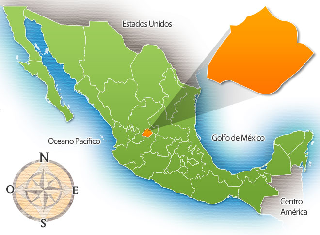
:::

::: {.fragment .callout-note icon="false" .column width="50%"}
### INFOTEC

Centro de Investigación del Gobierno Federal, que contribuye a la Transformación Digital de México, a través de la investigación, la innovación, la formación académica y el desarrollo de productos y servicios TIC. Sus alcances abarcan al sector público y privado, habilitando caminos que conduzcan hacia un México moderno y de inclusión digital.
:::
::::

# Introducción

## Definiciones

:::: {.columns}
::: {.callout-note icon="false" .column}
### Inteligencia Artificial (IA)

Conjunto de teorías, métodos y algoritmos para el desarrollo y estudio de sistemas que presentan un comportamiento que sería identificado como inteligente.
:::

::: {.fragment .callout-note icon="false" .column}
### Aprendizaje Computacional

Subárea de IA que estudia el desarrollo e implementación de algoritmos capaces de aprender de datos de manera autónoma sin haber sido explícitamente programados.
:::
::::

::: {.fragment .callout-note icon="false"}
### Procesamiento de Lenguaje Natural

Conjunto de teorías, métodos y algoritmos para el desarrollo y estudio de sistemas que permitan el entendimiento, generación y manipulación del lenguaje humano.
:::

::: {.fragment .callout-note icon="false"}
### Derecho y datos

La legislación es, ante todo, texto: leyes, reglamentos y decretos escritos en lenguaje natural que se modifican con el tiempo y que se pueden estudiar como datos.
:::

## Percepción de Inteligencia Artificial (IA)

:::: {.columns}

::: {.callout-tip icon="false" .column width=50%}
### Así la vemos

{height=300}
:::

::: {.fragment .callout-tip icon="false" .column width=50%}
### Así está

{fig-align="left" height="300px"}
:::
::::

## ¿Qué puede hacer el PLN?

:::: {.columns}

::: {.column}
{fig-align="center" }
:::

::: {.callout-tip icon="false" .column}
### Aplicaciones

- **Minería de opinión**
  - <span style="color: rgb(0, 0, 255);">positivo :) </span> --<span style="color: rgb(130, 130, 130);">neutro :|</span> --<span style="color: rgb(255, 0, 0);">negativo :( </span>
- **Análisis de tópicos**
- **Identificación de humor**
:::
::::

::: {.fragment .callout-note icon="false"}
### Aplicaciones jurídicas

- **Buscar leyes**: encontrar el artículo que responde a una necesidad
- **Responder preguntas** sobre la legislación vigente
- **Resumir** documentos jurídicos extensos
:::

# La inteligencia artificial y el derecho

## Un poco de historia

::: {.callout-note icon="false"}
### 1987

Primera Conferencia Internacional de Inteligencia Artificial y Derecho (ICAIL) [@ICAIL87]: el campo se institucionaliza.
:::

::: {.fragment .callout-tip icon="false"}
### GPT-4 y el examen de la barra

GPT-4 "aprobó" el examen de la barra de Estados Unidos [@Katz2024GPT-4Exam].
:::

::: {.fragment .callout-tip icon="false"}
### Una reevaluación

Al repetir la evaluación, las cifras resultaron más conservadoras [@Martinez2024Re-evaluatingPerformance].
:::

## El problema: las alucinaciones

:::: {.columns}
::: {.callout-tip icon="false" .column}
### Modelos generativos públicos

Alucinan **entre 58 % y 88 %** de las veces al preguntar sobre jurisprudencia federal estadounidense [@Dahl2024LargeModels].
:::

::: {.fragment .callout-tip icon="false" .column}
### Herramientas comerciales "libres de alucinación"

Aun así se equivocan **entre 17 % y 33 %** de las veces [@Magesh2025Hallucination-FreeTools].
:::
::::

::: {.fragment .callout-note icon="false"}
### Alucinar

Generar una respuesta que suena convincente, pero que cita leyes o casos que no existen o que dicen otra cosa.
:::

## ¿Y México?

::: {.callout-tip icon="false"}
### Evidencia concentrada en otros países

La validación de los sistemas de IA jurídica se ha concentrado en Estados Unidos y la Unión Europea; para América Latina la evidencia es escasa.
:::

::: {.fragment .callout-tip icon="false"}
### Para México

No se cuenta con puntos de referencia públicos ni con corpus abiertos construidos a partir de las leyes mexicanas vigentes.
:::

::: {.fragment .callout-tip icon="false"}
### Leyes dispersas

La legislación vigente está dispersa en fuentes heterogéneas y es de difícil consulta para quien no es especialista.
:::

## Cajas negras y confianza

:::: {.columns}
::: {.callout-tip icon="false" .column}
### Cajas negras

Los modelos de lenguaje operan como cajas negras: no sabemos por qué responden lo que responden.
:::

::: {.fragment .callout-tip icon="false" .column}
### Confianza

La confianza depende de que la persona usuaria entienda por qué el sistema recomienda algo [@Atkinson2020ExplanationFuture].
:::
::::

::: {.fragment .callout-note icon="false"}
### La respuesta debe remitir al artículo

Una respuesta jurídica útil es una que se puede verificar contra el texto vigente de la ley.
:::

# LegalIA

## El proyecto

:::: {.columns}
::: {.callout-tip icon="false" .column}
### Datos abiertos

Corpus que documentan el sistema jurídico mexicano, estandarizados y abiertos.
:::

::: {.fragment .callout-tip icon="false" .column}
### Modelos especializados

Modelos de lenguaje entrenados con texto jurídico mexicano, liberados abiertamente.
:::

::: {.fragment .callout-tip icon="false" .column}
### PLN jurídico

Clasificación, resumen y minería de argumentos en los términos del derecho mexicano.
:::
::::

::: {.fragment .callout-note icon="false"}
### Todo en abierto (Apache 2.0)

Código: <https://github.com/INGEOTEC/LegalIA>
Sitio: <https://ingeotec.github.io/LegalIA/>
:::

## ¿Dónde están las leyes?

:::: {.columns}
::: {.callout-note icon="false" .column}
### Diario Oficial de la Federación (DOF)

Medio oficial donde se publican los decretos, las leyes y sus reformas. Cada reforma aparece como una nota.
:::

::: {.fragment .callout-note icon="false" .column}
### Suprema Corte de Justicia de la Nación (SCJN)

Publica las leyes, reglamentos y lineamientos federales en su forma consolidada, con sus textos de reforma fechados.
:::
::::

# El Diario Oficial de la Federación

## Un siglo de notas

:::: {.columns}
::: {.callout-tip icon="false" .column}
### El archivo

* **1,232,802** notas
* **30,614** días de publicación
* Del **1917-01-01** al **2026-06-30**
* Se actualiza cada mes
:::

::: {.fragment .callout-tip icon="false" .column}
### ¿Qué formato tienen?

* HTML desde los años setenta; universal desde los 2000
* 25,500 notas sólo con PDF
* 4,308 notas, todas de los 1910, sin contenido
:::
::::

## ¿Cuánto se publica?

:::: {.columns}
::: {.callout-tip icon="false" .column}
### 1999

El volumen anual salta de **12,921** a **28,234** notas.
:::

::: {.fragment .callout-tip icon="false" .column}
### 2014

Máximo histórico: **36,041** notas en un año.
:::
::::

## ¿De qué habla el DOF? (1/2)

:::: {.columns}
::: {.callout-tip icon="false" .column}
### Zedillo

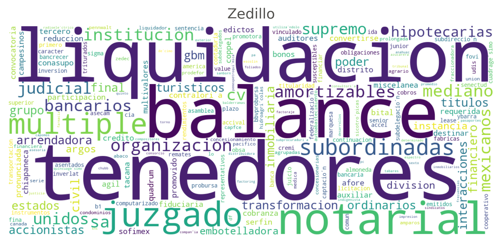
:::

::: {.fragment .callout-tip icon="false" .column}
### Fox

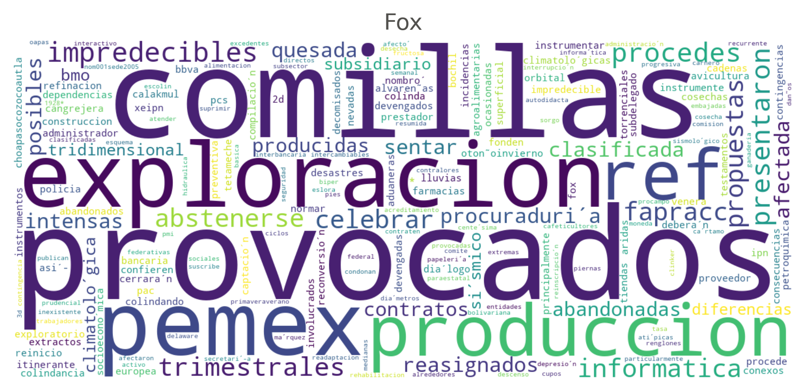
:::
::::

## ¿De qué habla el DOF? (2/2)

:::: {.columns}
::: {.callout-tip icon="false" .column}
### Calderón

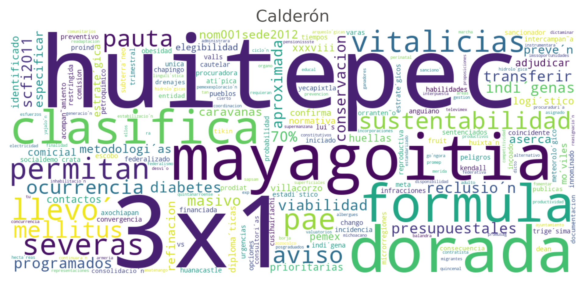
:::

::: {.fragment .callout-tip icon="false" .column}
### AMLO

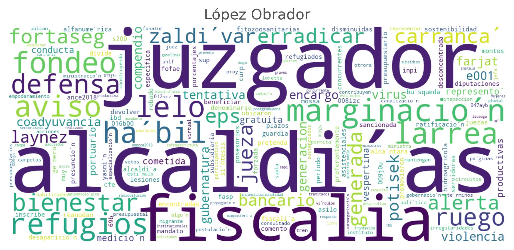
:::
::::

## 2019 vs 2025

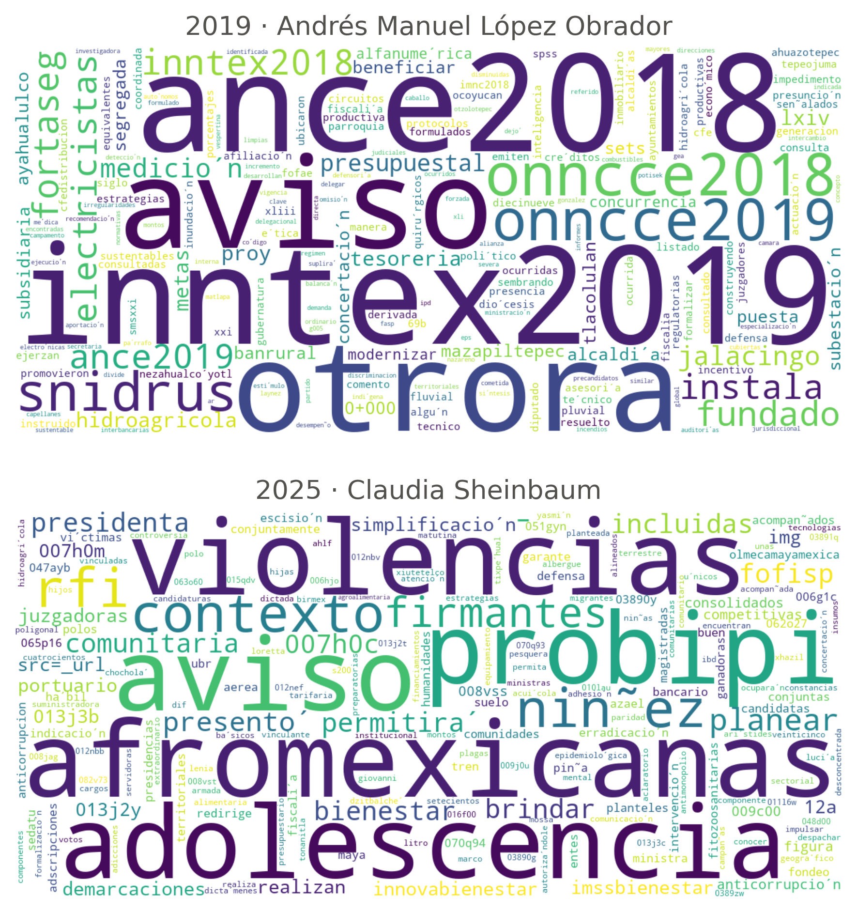{fig-align="center" height=560}

## ¿Cómo se escribe?

:::: {.columns}
::: {.callout-tip icon="false" .column}
### El tipo de documento

La primera palabra del título indica el tipo de documento. En 2025, "aviso" es el **43.9 %** de las notas.
:::

::: {.fragment .callout-tip icon="false" .column}
### Títulos más cortos

La longitud mediana del título cae de unas **20 palabras** a **5–6**.
:::
::::

# Las leyes federales

## 315 leyes, 3,724 versiones

:::: {.columns}
::: {.callout-tip icon="false" .column}
### Leyes

* **3,724** versiones fechadas ("textos de reforma")
* De **315** de los 316 instrumentos federales catalogados
* De 1889 a 2026
:::

::: {.fragment .callout-tip icon="false" .column}
### Enlace con el DOF

* **87.7 %** enlazadas a su decreto en el DOF
* 66.4 % por título, 21.3 % por contenido
* Además: 1,082 reglamentos y 126 lineamientos
:::
::::

## De la nota al artículo

```{mermaid}
%%| fig-width: 10
flowchart LR
    A[DOF / SIDOF] --> B[dofjson]
    B --> C[nota2md]
    B --> D[document2md<br/>OCR]
    C --> E[md2akn<br/>artículo, fracción]
    D --> E
    E --> F[vectores]
```

::: {.fragment style="font-size: 70%; text-align: center;"}
Paquetes en PyPI, licencia Apache 2.0
:::

## Reconstruir una ley a partir de sus reformas

::: {.callout-note icon="false"}
### La idea

Cada decreto modifica artículos. Con todos los decretos en orden, el texto vigente de una ley se vuelve a armar.
:::

::: {.fragment .callout-tip icon="false"}
### Un ejemplo

La Constitución: **1,328** disposiciones, reconstruidas a partir de sus reformas.
:::

# El atlas

## ¿Qué tan cerca están dos leyes?

:::: {.columns}
::: {.callout-note icon="false" .column}
### La pregunta

Cada artículo busca a su "gemelo": el texto más parecido que está en otra ley.
:::

::: {.fragment .callout-tip icon="false" .column}
### El vecino más cercano

* El texto más cercano (coseno) **fuera** de su propio instrumento
* Si ese texto lo comparten *m* instrumentos, cada uno recibe 1/*m*
:::
::::

## Texto → números

:::: {.columns}
::: {.callout-tip icon="false" .column}
### Un texto, un vector

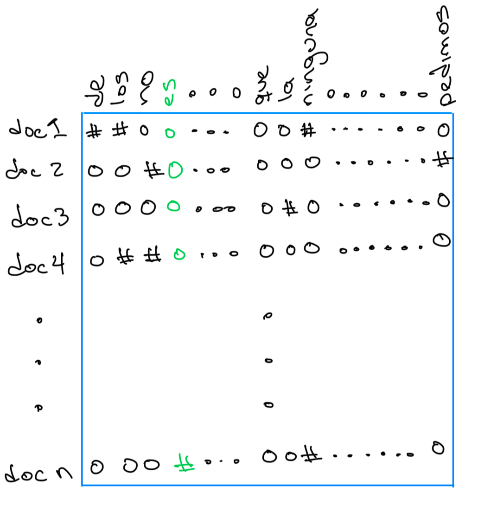{height=330}
:::

::: {.fragment .callout-tip icon="false" .column}
### Textos parecidos, vectores cercanos

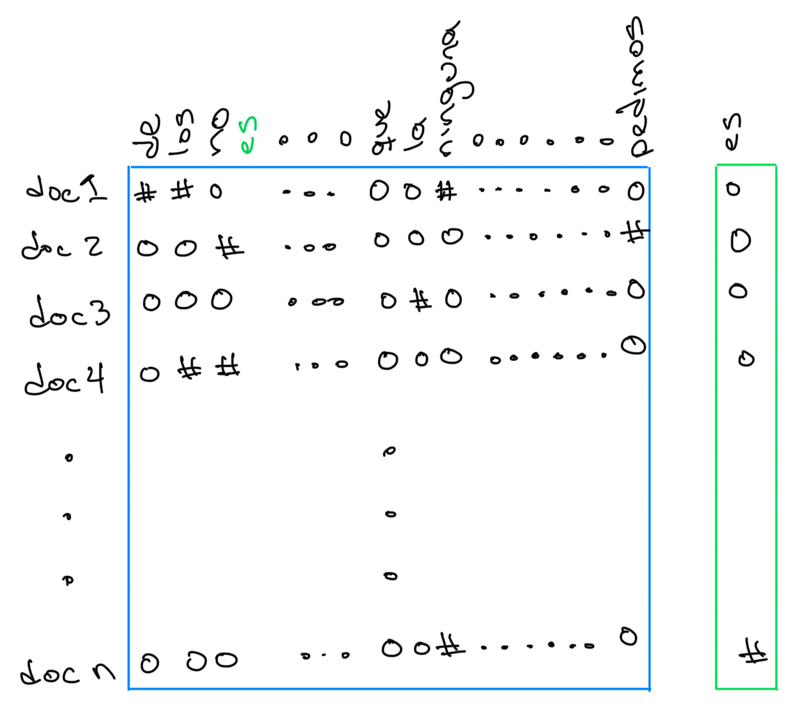{height=325}
:::
::::

::: {.fragment style="font-size: 70%; text-align: center;"}
Modelo Qwen3-Embedding-0.6B: 1,024 dimensiones (alternativa 4B: 2,560)
:::

## De artículos a instrumentos

:::: {.columns}
::: {.callout-tip icon="false" .column}
### Disposiciones

* **161,989** disposiciones
* 28,568 encabezados y 21,344 transitorios se excluyen
* 1,715 textos idénticos compartidos se descartan
* **110,362** disposiciones contadas
:::

::: {.fragment .callout-tip icon="false" .column}
### Instrumentos

* 315 leyes, 863 reglamentos y 125 lineamientos
* **1,303** instrumentos únicos (de reglamentos y lineamientos reeditados sólo se conserva el más reciente)
* Matriz dirigida instrumento × instrumento: 32,539 celdas no nulas
:::
::::

## Dibujar el mapa

:::: {.columns}
::: {.callout-note icon="false" .column width="40%"}
### UMAP

"Aplanar" el espacio de 1,024 dimensiones a una hoja, de modo que los instrumentos cercanos queden juntos.

::: {.fragment}
La **vecindad** (4, 8, 16 o 32) cambia el dibujo, no los datos.
:::
:::

::: {.column width="60%"}
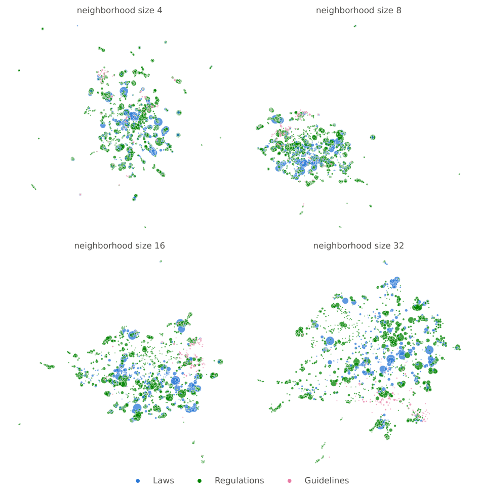{fig-align="center" height=520}
:::
::::

## El atlas

```{=html}
<iframe src="https://ingeotec.github.io/LegalIA/pages/atlas.html" width="100%" height="600"></iframe>
```

## Cómo leerlo

:::: {.columns}
::: {.column width="50%"}
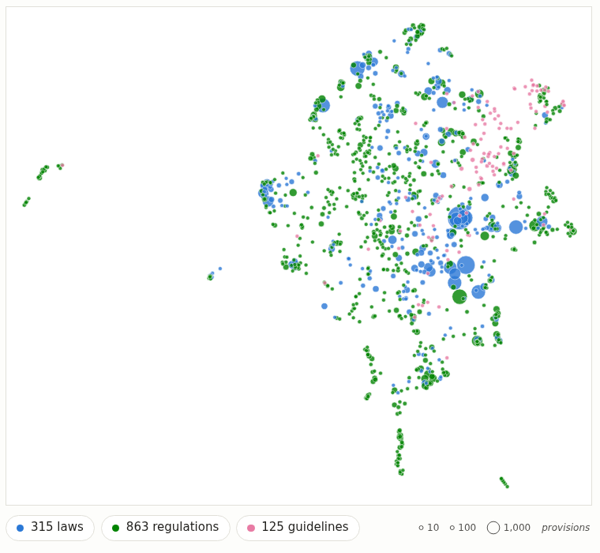{fig-align="center" height=520}
:::

::: {.callout-tip icon="false" .column width="50%"}
### Cómo leer el mapa

* **Azul**: leyes (315)
* **Verde**: reglamentos (863)
* **Magenta**: lineamientos (125)
* El **área** del punto es proporcional al número de disposiciones
* Al elegir un instrumento se ven sus 5 vecinos salientes y 5 entrantes
:::
::::

## Ejemplo: Universidad Autónoma Chapingo

:::: {.columns}
::: {.column width="60%"}
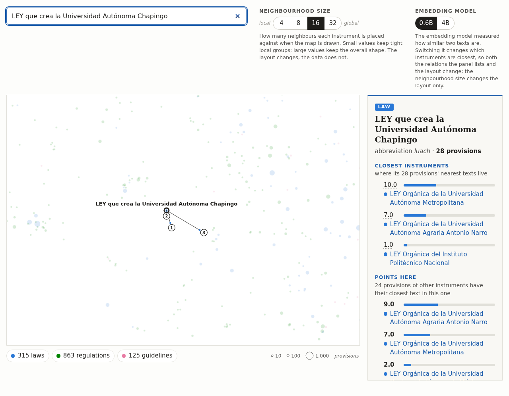{fig-align="center"}
:::

::: {.callout-tip icon="false" .column width="40%"}
### Ley de la UACh

* 28 disposiciones, 18 contadas
* 10 → Ley Orgánica de la UAM
* 7 → Antonio Narro
* 1 → IPN
* 24 disposiciones ajenas apuntan a ella
:::
::::

## Ejemplo: la Constitución

:::: {.columns}
::: {.column width="60%"}
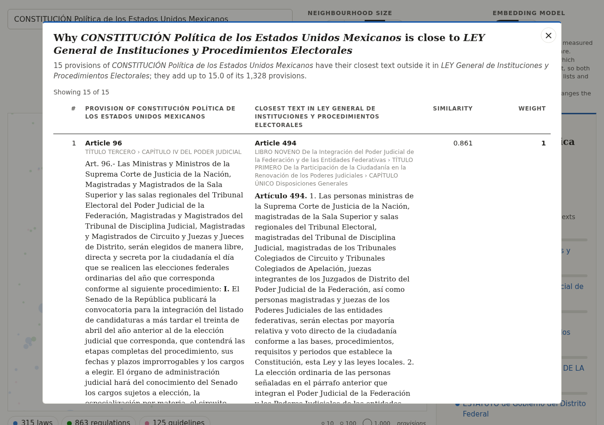{fig-align="center"}
:::

::: {.callout-tip icon="false" .column width="40%"}
### CPEUM

1,328 disposiciones, 137 contadas. Vecinos más cercanos:

* LGIPE: **15.0**
* LOPJF: 9.0
* Ley Orgánica del Congreso: 8.0
:::
::::

## Cada vecindad se explica

:::: {.columns}
::: {.column width="60%"}
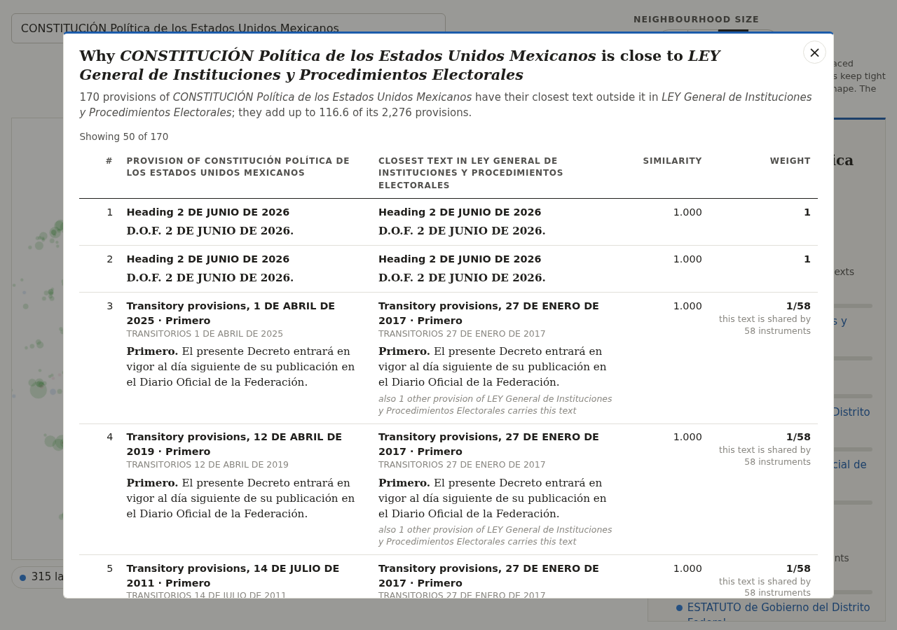{fig-align="center"}
:::

::: {.callout-tip icon="false" .column width="40%"}
### Pares de artículos

Cada peso abre la tabla de pares de artículos que lo explican.

::: {.fragment}
Art. 96 CPEUM ↔ art. 494 LGIPE: similitud **0.86**
:::
:::
::::

## ¿Quién recibe más?

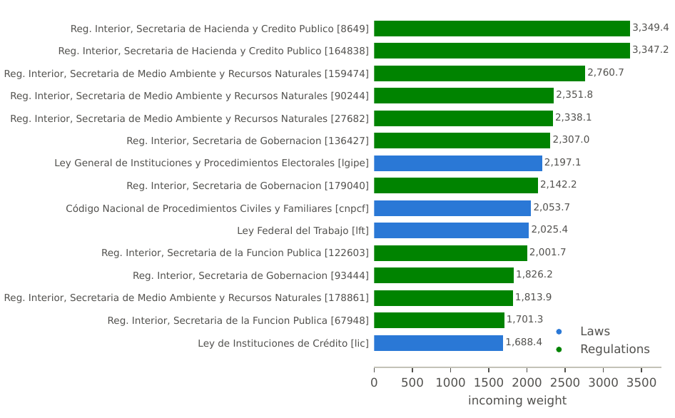{fig-align="center" height=520}

## Un mapa, dos modelos

:::: {.columns}
::: {.callout-note icon="false" .column width="40%"}
### 0.6B vs 4B

El modelo de representación cambia qué instrumentos están más cerca, y por tanto cambia las relaciones y el dibujo.
:::

::: {.column width="60%"}
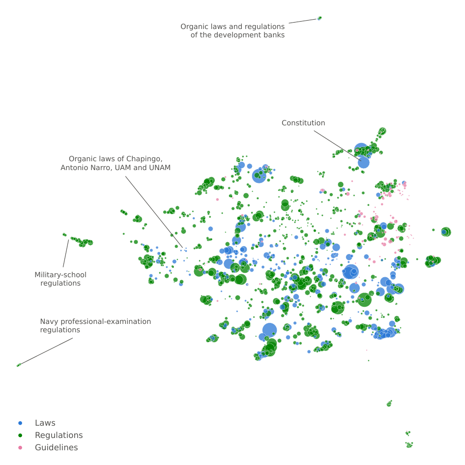{fig-align="center" height=520}
:::
::::

# ¿Qué sigue?

## Objetivos {style="font-size: 75%;"}

::: {.callout-note icon="false"}
### Objetivo general

Desarrollar y evaluar sistemas explicables de inteligencia artificial que ofrezcan respuestas trazables y eficientes, apoyados en corpus jurídicos, para tareas del derecho mexicano.
:::

:::: {.columns}
::: {.column width="50%"}
::: {.callout-tip icon="false"}
### Objetivos específicos

1. Corpus abiertos del derecho mexicano vigente
2. Sistemas híbridos de recuperación y búsqueda semántica
3. Respuesta a preguntas sobre códigos vigentes, con citas y abstención
4. Resúmenes con trazabilidad al texto original
:::
:::

::: {.column width="50%"}
::: {.callout-tip icon="false"}
### &nbsp;

5. Conjuntos de evaluación y protocolo público
6. Análisis de explicabilidad
7. Difusión en acceso abierto
:::
:::
::::

## Plan de trabajo {style="font-size: 80%;"}

:::: {.columns}
::: {.callout-tip icon="false" .column}
### PT1. Corpus abiertos

Meses 1–10
:::

::: {.fragment .callout-tip icon="false" .column}
### PT2. Sistemas híbridos explicables

Meses 4–15
:::

::: {.fragment .callout-tip icon="false" .column}
### PT3. Evaluación y difusión

Meses 7–18
:::
::::

::: {.fragment .callout-note icon="false"}
### Hitos

* **Mes 6**: corpus v1 interno
* **Mes 10**: corpus público
* **Mes 12**: prototipos de recuperación y de respuesta a preguntas, y primer manuscrito
* **Mes 15**: resúmenes y explicabilidad, y código liberado
* **Mes 18**: protocolo y conjuntos de evaluación
:::

## Respuestas que citan la ley

:::: {.columns}
::: {.callout-tip icon="false" .column}
### Buscador

Encontrar el artículo correcto, combinando búsqueda por palabras y por significado.
:::

::: {.fragment .callout-tip icon="false" .column}
### Preguntas

Responder citando las disposiciones, y abstenerse cuando no hay evidencia suficiente.
:::

::: {.fragment .callout-tip icon="false" .column}
### Resúmenes

Cada afirmación del resumen se vincula con el segmento del documento que la origina.
:::
::::

::: {.fragment .callout-note icon="false"}
### Eficiencia

Sistemas que priorizan la trazabilidad y la eficiencia sobre el cómputo de alto desempeño, pensados para las condiciones reales de instituciones y despachos.
:::

# Conclusiones

## Temas

:::: {.columns}
::: {.column width="50%"}
::: {.callout-tip icon="false"}
### Técnicas

* Inteligencia artificial
* Procesamiento de lenguaje natural
* Representaciones densas y mapas (UMAP)
:::
:::

::: {.column width="50%"}
::: {.callout-tip icon="false"}
### Recursos y tareas

* Corpus del DOF y de las leyes federales
* Atlas de la legislación federal
* Búsqueda, preguntas y resúmenes con citas
:::
:::
::::

::: {.callout-note icon="false" .fragment}
### Todo es abierto

Paquetes en PyPI, releases con licencia Creative Commons, sitio web y código Apache 2.0: <https://ingeotec.github.io/LegalIA/>
:::

# Referencias

::: {#refs}
:::

# ¡Gracias!
