# Introducción

## Definiciones {.fs75}

:::: {.columns}
::: {.callout-note icon="false" .column}
### Inteligencia Artificial (IA)

Conjunto de teorías, métodos y algoritmos para el desarrollo y estudio de sistemas que presentan un comportamiento que sería identificado como inteligente.
:::

::: {.fragment .callout-note icon="false" .column}
### Aprendizaje Computacional

Subárea de IA que estudia el desarrollo e implementación de algoritmos capaces de aprender de datos de manera autónoma sin haber sido explícitamente programados.
:::
::::

::: {.fragment .callout-note icon="false"}
### Procesamiento de Lenguaje Natural

Conjunto de teorías, métodos y algoritmos para el desarrollo y estudio de sistemas que permitan el entendimiento, generación y manipulación del lenguaje humano.
:::

::: {.fragment .callout-note icon="false"}
### Derecho y datos

La legislación es, ante todo, texto. Son leyes, reglamentos y tratados escritos en lenguaje natural, que se modifican con el tiempo y que se pueden estudiar como datos.
:::

## Percepción de Inteligencia Artificial (IA)

:::: {.columns}

::: {.callout-tip icon="false" .column width=50%}
### Así la vemos

{height=300}
:::

::: {.fragment .callout-tip icon="false" .column width=50%}
### Así está

{fig-align="left" height="300px"}
:::
::::

## ¿Qué puede hacer el PLN? {.fs80}

:::: {.columns}

::: {.column}
{fig-align="center" height=250}
:::

::: {.callout-tip icon="false" .column}
### Aplicaciones

- **Minería de opinión**
  - <span style="color: rgb(0, 0, 255);">positivo :) </span> --<span style="color: rgb(130, 130, 130);">neutro :|</span> --<span style="color: rgb(255, 0, 0);">negativo :( </span>
- **Análisis de tópicos**
- **Identificación de humor**
:::
::::

::: {.fragment .callout-note icon="false"}
### Aplicaciones jurídicas

- **Buscar leyes** para encontrar el artículo que responde a una necesidad
- **Responder preguntas** sobre la legislación vigente
- **Resumir** documentos jurídicos extensos
:::

# La inteligencia artificial y el derecho

## Un poco de historia

::: {.callout-note icon="false"}
### 1987

Primera Conferencia Internacional de Inteligencia Artificial y Derecho (ICAIL) [@ICAIL87]. Con ella el campo se institucionaliza.
:::

::: {.fragment .callout-tip icon="false"}
### GPT-4 y el examen de la barra

GPT-4 "aprobó" el examen de la barra de Estados Unidos [@Katz2024GPT-4Exam].
:::

::: {.fragment .callout-tip icon="false"}
### Una reevaluación

Al repetir la evaluación, las cifras resultaron más conservadoras [@Martinez2024Re-evaluatingPerformance].
:::

## Las alucinaciones

:::: {.columns}
::: {.callout-tip icon="false" .column}
### Modelos generativos públicos

Alucinan **entre 58 % y 88 %** de las veces al preguntar sobre jurisprudencia federal estadounidense [@Dahl2024LargeModels].
:::

::: {.fragment .callout-tip icon="false" .column}
### Herramientas comerciales "libres de alucinación"

Aun así se equivocan **entre 17 % y 33 %** de las veces [@Magesh2025Hallucination-FreeTools].
:::
::::

::: {.fragment .callout-note icon="false"}
### Alucinar

Es generar una respuesta que suena convincente, pero que cita leyes o casos que no existen o que dicen otra cosa.
:::

## ¿Y México?

::: {.callout-tip icon="false"}
### Evidencia concentrada en otros países

La validación de los sistemas de IA jurídica se ha concentrado en Estados Unidos y la Unión Europea, así que para América Latina la evidencia es escasa.
:::

::: {.fragment .callout-tip icon="false"}
### Para México

No se cuenta con puntos de referencia públicos ni con corpus abiertos construidos a partir de las leyes mexicanas vigentes.
:::

::: {.fragment .callout-tip icon="false"}
### Leyes dispersas

La legislación vigente está dispersa en fuentes heterogéneas y es de difícil consulta para quien no es especialista.
:::

## Cajas negras y confianza

:::: {.columns}
::: {.callout-tip icon="false" .column}
### Cajas negras

Los modelos de lenguaje operan como cajas negras y no sabemos por qué responden lo que responden.
:::

::: {.fragment .callout-tip icon="false" .column}
### Confianza

La confianza depende de que la persona usuaria entienda por qué el sistema recomienda algo [@Atkinson2020ExplanationFuture].
:::
::::

::: {.fragment .callout-note icon="false"}
### La respuesta debe remitir al artículo

Una respuesta jurídica útil es una que se puede verificar contra el texto vigente de la ley.
:::

# LegalIA

## El proyecto {.fs85}

:::: {.columns}
::: {.callout-tip icon="false" .column width="32%"}
### Datos abiertos

Corpus que documentan el sistema jurídico mexicano, estandarizados y abiertos.
:::

::: {.fragment .callout-tip icon="false" .column width="32%"}
### Modelos especializados

Modelos de lenguaje entrenados con texto jurídico mexicano, liberados abiertamente.
:::

::: {.fragment .callout-tip icon="false" .column width="32%"}
### PLN jurídico

Clasificación, resumen y minería de argumentos en los términos del derecho mexicano.
:::
::::

::: {.fragment .callout-note icon="false"}
### Todo en abierto (Apache 2.0)

El código está en <https://github.com/INGEOTEC/LegalIA> y el sitio en <https://ingeotec.github.io/LegalIA/>.
:::

## ¿Dónde están las leyes?

:::: {.columns}
::: {.callout-note icon="false" .column}
### Diario Oficial de la Federación (DOF)

Es el medio oficial donde se publican los decretos, las leyes y sus reformas. Cada reforma aparece como un decreto.
:::

::: {.fragment .callout-note icon="false" .column}
### Suprema Corte de Justicia de la Nación (SCJN)

Publica los textos consolidados y editoriales de las leyes, los reglamentos, los lineamientos y los tratados.
:::
::::

::: {.fragment .callout-tip icon="false"}
### LegalIA parte de la SCJN

Sus textos ya traen cada instrumento completo y con su nombre, así que no hace falta reconstruirlos a partir de los decretos del DOF.
:::

## ¿Cómo se conectan las leyes? {.fs85 .nostretch}

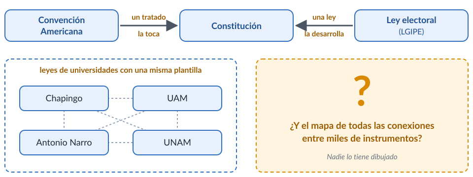{fig-align="center" width="80%"}

:::: {.columns}
::: {.fragment .callout-note icon="false" .column}
### El problema

Las leyes, los reglamentos, los lineamientos y los tratados están conectados de muchas maneras, pero nadie tiene un mapa de esas conexiones entre miles de instrumentos.
:::

::: {.fragment .callout-tip icon="false" .column}
### La meta

Dibujar ese mapa, un atlas de las leyes, a partir del texto mismo y sin depender de que un instrumento cite a otro.
:::
::::

## Cuatro corpus abiertos

Las cuatro colecciones de la SCJN se publican como datos abiertos.

| Colección | Instrumentos en el mapa |
|:--|--:|
| Leyes | 314 |
| Reglamentos | 864 |
| Lineamientos | 125 |
| Tratados | 1,367 |
| **Total** | **2,670** |

## Lo que publica la Corte

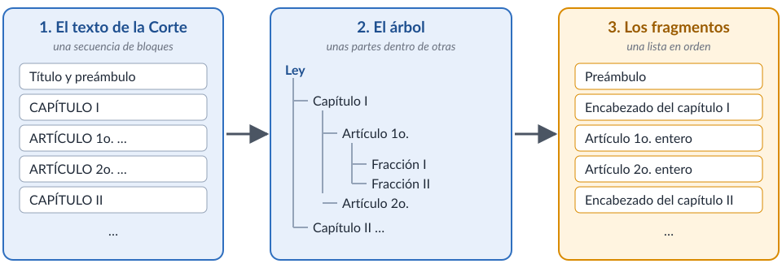{fig-align="center" width="95%"}

## Chapingo, tal como llega {.fs70}

```{=html}
<pre style="white-space: pre-wrap; font-size: 0.62em; line-height: 1.4; max-height: none; padding: 0.6em;"><code>**LEY QUE CREA LA UNIVERSIDAD AUTONOMA CHAPINGO**
**ULTIMA REFORMA PUBLICADA EN EL DIARIO OFICIAL DE LA FEDERACION: 30 DE DICIEMBRE DE 1977.**
Ley publicada en el Diario Oficial de la Federación, el lunes 30 de diciembre de 1974.
LUIS ECHEVERRIA ALVAREZ, Presidente Constitucional de los Estados Unidos Mexicanos, a sus habitantes, sabed:
Que el H. Congreso de la Unión se ha servido dirigirme el siguiente
**D E C R E T O**
"El Congreso de los Estados Unidos Mexicanos, decreta:
**LEY QUE CREA LA UNIVERSIDAD AUTONOMA CHAPINGO**
**CAPITULO I**
De su Naturaleza, Objetivos y Medios
**ARTICULO 1o.-** Se crea la Universidad Autónoma Chapingo como organismo descentralizado del Estado, con personalidad jurídica, patrimonio propio y sede de gobierno en Chapingo, Estado de México.</code></pre>
```

::: {.fragment .callout-note icon="false"}
### Texto plano

Es una sola tira de texto. Nada en ella dice dónde empieza un capítulo o dónde termina un artículo, más allá de sus líneas.
:::

## Chapingo, sus 29 fragmentos {.fs80}

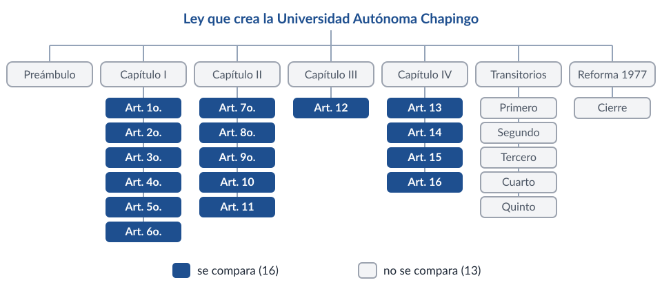{fig-align="center" width="85%"}

::: {style="text-align: center;"}
La ley tiene 29 fragmentos y 16 de ellos se comparan.
:::

::: {.fragment style="font-size: 80%; text-align: center;"}
Cuáles se dejan fuera y por qué se explica más adelante, en «Qué se compara y qué no».
:::

## Del texto a los fragmentos

:::: {.columns}
::: {.callout-note icon="false" .column}
### Bloques con un esquema

La SCJN sirve cada instrumento en bloques, y esos bloques se convierten en un árbol con el vocabulario de Akoma Ntoso [@palmirani2011].
:::

::: {.fragment .callout-tip icon="false" .column}
### El artículo entero

La unidad es el artículo completo, tenga la longitud que tenga, porque es lo que una persona del derecho cita.
:::
::::

:::: {.columns}
::: {.fragment .callout-tip icon="false" .column}
### Cobertura total

Unas pruebas comprueban que todo el texto de un bloque cae en algún fragmento y que ninguno se pierde.
:::

::: {.fragment .callout-note icon="false" .column}
### ¿Fragmento o disposición?

Un encabezado o un preámbulo no es una disposición. Por eso se dice fragmento, que puede ser un artículo, un transitorio o un título.
:::
::::

# El atlas

## ¿Qué tan cerca están dos leyes?

:::: {.columns}
::: {.callout-note icon="false" .column}
### La pregunta

Cada fragmento busca a su "gemelo", que es el texto más parecido fuera de su propio instrumento.
:::

::: {.fragment .callout-tip icon="false" .column}
### El vecino más cercano

* El texto más cercano (coseno) **fuera** de su propio instrumento
* Si ese texto lo comparten *m* instrumentos, cada uno recibe 1/*m*
:::
::::

## Texto → números

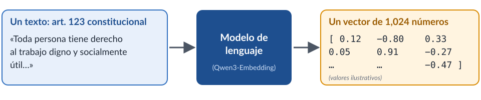{fig-align="center" width="75%"}

::: {.fragment}
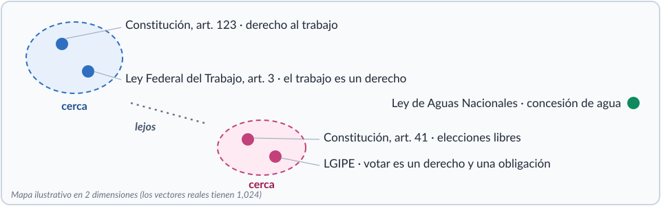{fig-align="center" width="75%"}
:::

::: {.fragment style="font-size: 60%; text-align: center;"}
Qwen3-Embedding [@Zhang2025Qwen3Models] da 2,560 números en el 4B y 1,024 en el 0.6B.
:::

## Qué se compara y qué no {.fs85}

:::: {.columns}
::: {.callout-tip icon="false" .column}
### Los fragmentos al 28 de octubre de 2026

* **227,132** fragmentos en total
* No se comparan 36,137 encabezados, 22,575 transitorios y 10,093 de envoltura
* **158,327** fragmentos comparados
:::

::: {.fragment .callout-tip icon="false" .column}
### Los compartidos

* 1,895 fragmentos comparados tienen un texto idéntico que varios instrumentos comparten, y no se cuentan
* El artículo 56 del Código Civil Federal se reduce a su etiqueta y coincide con el 56 de otras tres leyes
* **156,432** fragmentos contados
:::
::::

::: {.fragment .callout-note icon="false"}
### La envoltura y la matriz

La envoltura es el bloque de título que la Corte imprime y, en un tratado, el decreto de promulgación y su certificación. Con los fragmentos contados se llena una matriz dirigida de 2,670 × 2,670 instrumentos, con 47,157 celdas no nulas, y ningún texto lo comparten más de 14 instrumentos.
:::

## Dibujar el mapa

:::: {.columns}
::: {.callout-note icon="false" .column width="40%"}
### UMAP

"Aplana" el espacio de 2,560 dimensiones a una hoja, de modo que los instrumentos cercanos queden juntos [@McInnes2018UMAPReduction].

::: {.fragment}
La **vecindad** (4, 8, 16 o 32) cambia el dibujo y no los datos.
:::
:::

::: {.column width="60%"}
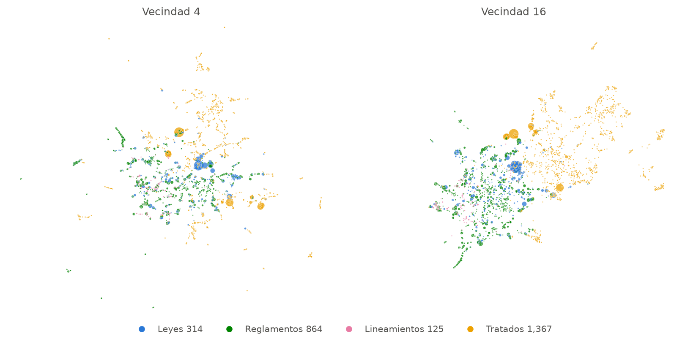{fig-align="center" height=520}
:::
::::

## Mapas alineados y estelas {.fs75}

:::: {.columns}
::: {.callout-note icon="false" .column width="40%"}
### Doce mapas, uno solo

Tres similitudes por cuatro vecindades dan doce mapas. Cada uno se gira, se refleja y se escala sobre el del 4B a vecindad 16 [@Grave2019WassersteinProcrustes].

::: {.fragment}
Con la alineación el desplazamiento medio baja de 0.19–0.54 a 0.10–0.28.
:::

::: {.fragment}
Al cambiar de vecindad, cada instrumento que se mueve 4 px o más deja una estela de su color que se desvanece en 2.5 s.
:::
:::

::: {.column width="60%"}
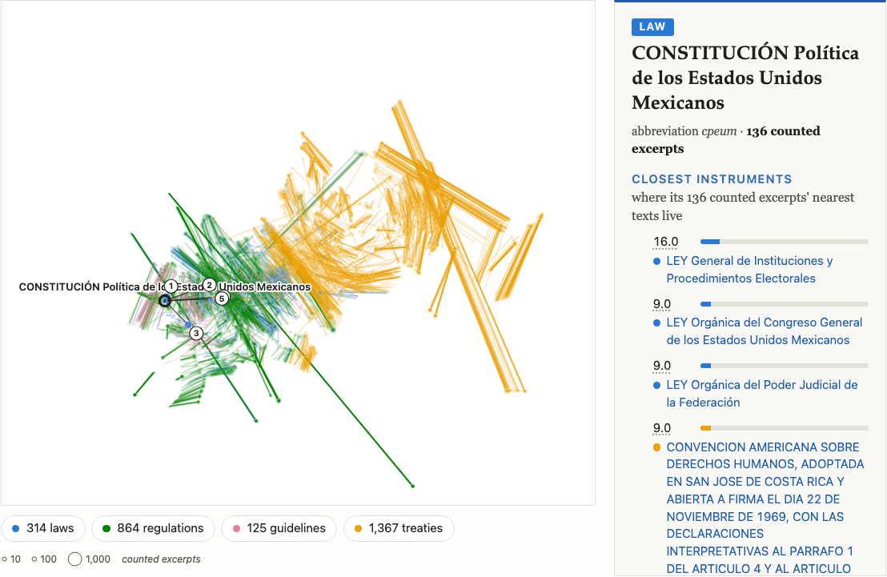{fig-align="center" height=470}
:::
::::

## El atlas

```{=html}
<iframe src="https://ingeotec.github.io/LegalIA/pages/atlas.html" width="100%" height="540"></iframe>
```

## Cómo leerlo

:::: {.columns}
::: {.column width="50%"}
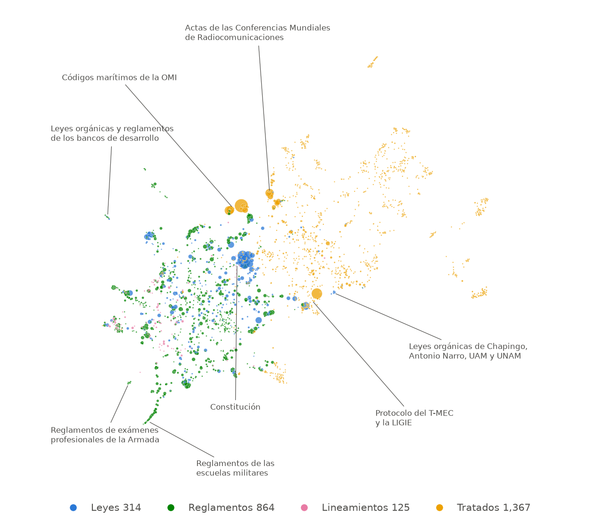{fig-align="center" height=520}
:::

::: {.callout-tip icon="false" .column width="50%"}
### Cómo leer el mapa

* Azul, las leyes (314)
* Verde, los reglamentos (864)
* Magenta, los lineamientos (125)
* Amarillo, los tratados (1,367)
* El **área** del punto es proporcional al número de fragmentos contados
* Al elegir un instrumento se ven sus cinco vecinos salientes y cinco entrantes
:::
::::

## Qué muestra el mapa {.fs80}

:::: {.columns}
::: {.callout-tip icon="false" .column}
### Dos cuerpos

Para 1,298 de los 1,367 tratados el instrumento más cercano es otro tratado. Sólo 10 leyes, 6 reglamentos y 2 lineamientos tienen un tratado como el más cercano.
:::

::: {.fragment .callout-tip icon="false" .column}
### Islas de familias

Hay islas de reglamentos de exámenes de la Armada, de reglamentos de las escuelas militares y de bancos de desarrollo. También las leyes orgánicas de Chapingo, Antonio Narro, la UAM y la UNAM quedan juntas.
:::
::::

::: {.fragment .callout-note icon="false"}
### Donde los cuerpos se tocan

La Ley General de Salud queda entre sus reglamentos, y la LIGIE junto al protocolo del T-MEC.
:::

## Un ejemplo, Chapingo {.fs85}

:::: {.columns}
::: {.column width="60%"}
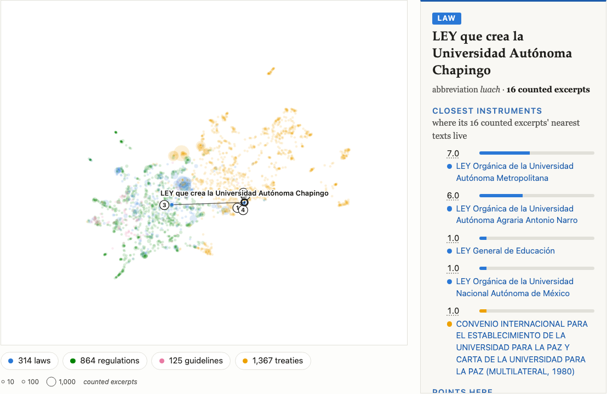{fig-align="center"}
:::

::: {.callout-tip icon="false" .column width="40%"}
### Ley de la UACh

* 29 fragmentos y 16 contados
* 7 van a la Ley Orgánica de la UAM
* 6 van a la de Antonio Narro
* 1 va a la Ley General de Educación, 1 a la Ley Orgánica de la UNAM y 1 al Convenio de la Universidad para la Paz
* 18 fragmentos ajenos apuntan a ella
:::
::::

## Otro ejemplo, la Constitución {.fs85}

:::: {.columns}
::: {.column width="60%"}
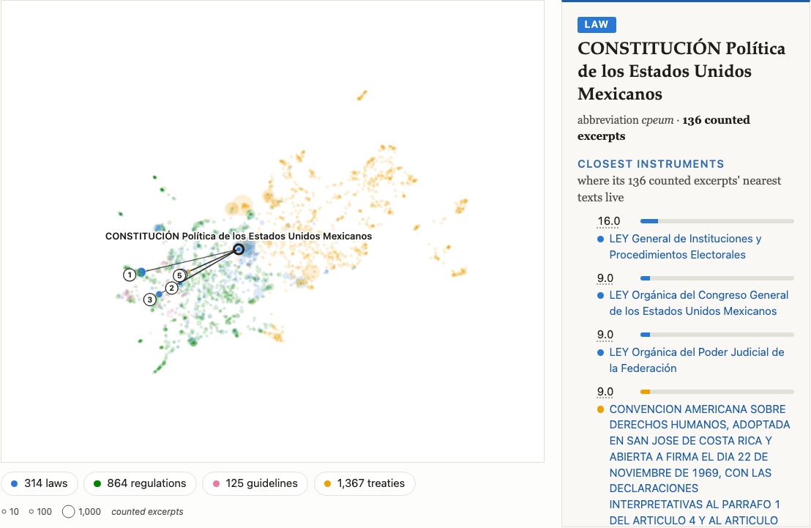{fig-align="center"}
:::

::: {.callout-tip icon="false" .column width="40%"}
### CPEUM

Tiene 1,347 fragmentos y 136 contados. Sus vecinos más cercanos son

* LGIPE, con **16.0**
* Ley Orgánica del Congreso, con 9.0
* Ley Orgánica del Poder Judicial, con 9.0
* Convención Americana sobre Derechos Humanos, con 9.0
:::
::::

## Cada vecindad se explica {.fs85}

:::: {.columns}
::: {.column width="60%"}
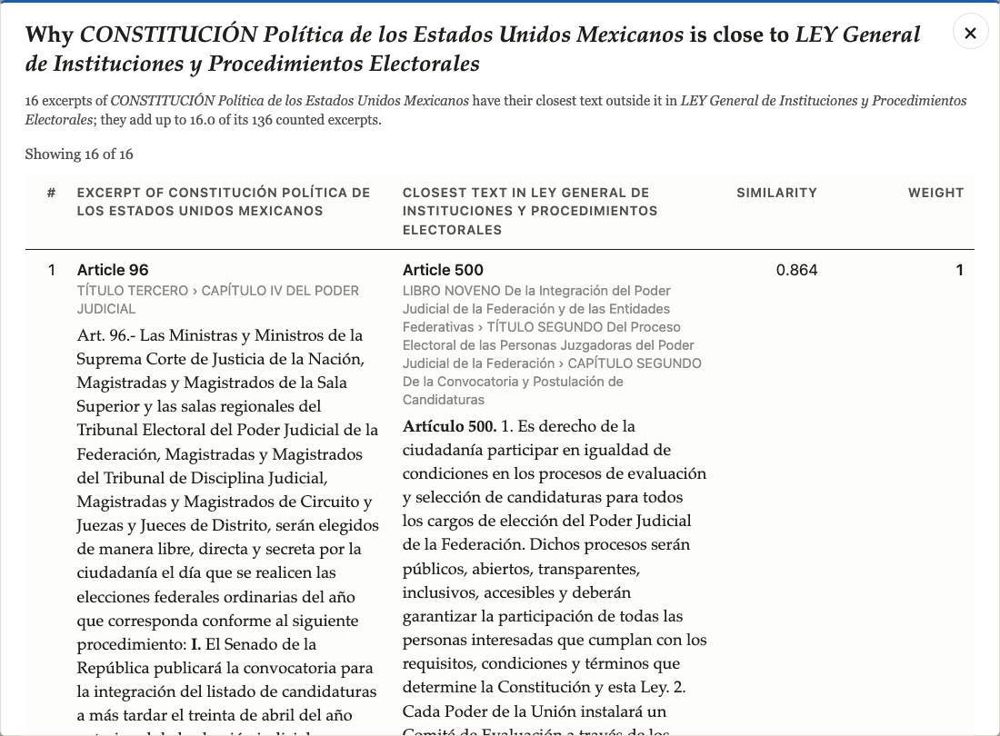{fig-align="center"}
:::

::: {.callout-tip icon="false" .column width="40%"}
### Pares de fragmentos

Cada peso abre la tabla de pares de fragmentos que lo explican. Con la LGIPE hay 16 artículos enteros.

::: {.fragment}
El artículo 96 de la Constitución se parece al 500 de la LGIPE con una similitud de **0.86**, y el 58 al 10 con **0.54**.
:::
:::
::::

## ¿Quién recibe más?

:::: {.columns}
::: {.column width="62%"}
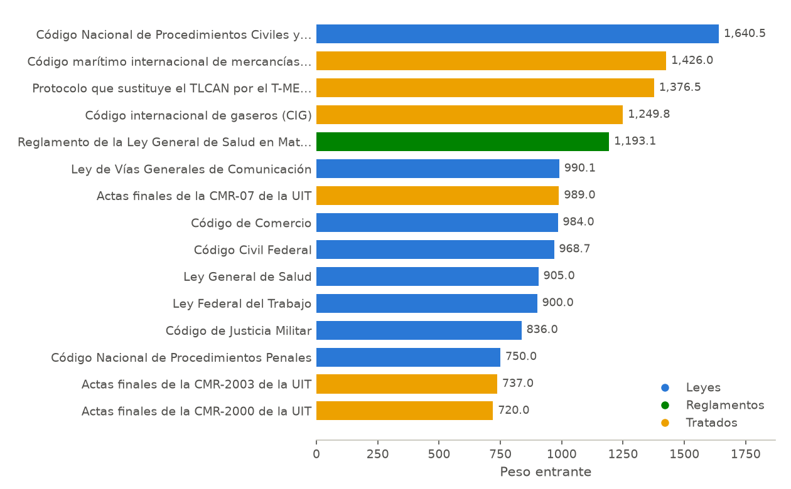{fig-align="center" height=520}
:::

::: {.callout-note icon="false" .column width="38%"}
### Mayor peso entrante

Encabeza el Código Nacional de Procedimientos Civiles y Familiares con 1,640.5, sobre todo por el Código Civil Federal. Siguen el Código IMDG, el Protocolo del T-MEC, el Código de Gaseros y el Reglamento de la Ley General de Salud en materia de control sanitario.
:::
::::

## Una pregunta, tres métodos {.fs85}

:::: {.columns}
::: {.callout-note icon="false" .column width="40%"}
### 0.6B, 4B y BM25

La misma pregunta se contesta con Qwen3-Embedding en sus tamaños de 0.6B y 4B y con BM25 [@Robertson2009TheBeyond] como línea base de palabras. Cada método cambia qué instrumentos están más cerca y por tanto cambia el dibujo.

::: {.fragment}
El mapa abre con el 4B.
:::
:::

::: {.column width="60%"}
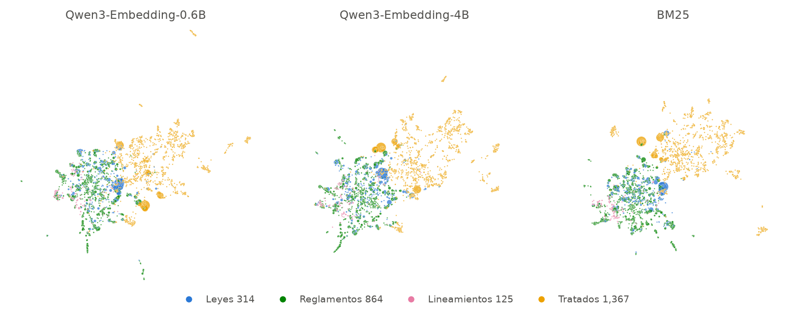{fig-align="center" height=520}
:::
::::

# ¿El mapa acierta?

## Vínculos fuertes {.fs75}

:::: {.columns}
::: {.callout-note icon="false" .column}
### Qué son

Son vínculos que el texto declara. La señal A es el nombre del instrumento y la señal B es la frase "tiene por objeto". Dan 277 vínculos de 253 instrumentos, y 62 nombres no se resuelven y se dejan fuera.
:::

::: {.fragment .callout-tip icon="false" .column}
### Qué se encuentra

El más cercano es un vínculo fuerte para 125, 129 y 131 de los 253 (0.6B, 4B y BM25). Uno de ellos está entre los cinco más cercanos para 194, 202 y 196. De los 209 reglamentos, el más cercano es su ley para 121, 122 y 124.
:::
::::

::: {.fragment .callout-tip icon="false"}
### Empates y BM25

De las 18 comparaciones, 16 son empates y BM25 nunca pierde. Para esta tarea una medida de palabras es tan buena como los modelos.
:::

## Citas fragmento por fragmento {.fs80}

:::: {.columns}
::: {.callout-note icon="false" .column}
### Las citas

Hay 3,480 fragmentos que citan exactamente un instrumento, y 1,067 de ellos citan la Constitución. Se mide si el instrumento citado está entre los cinco más cercanos.
:::

::: {.fragment .callout-tip icon="false" .column}
### Los resultados

Lo está para 0.309, 0.342 y 0.317 de los fragmentos (0.6B, 4B y BM25), y el rango mediano es 18, 14 y 15. El 4B es mejor que el 0.6B en las cinco medidas y que BM25 en tres.
:::
::::

::: {.fragment .callout-note icon="false"}
### Por qué el nivel es bajo

Citar un instrumento no es repetir su texto, así que el nivel absoluto es bajo aun cuando la relación existe. Por eso el mapa abre con el 4B y se lee como una descripción y no como una medida.
:::

## Leer cada instrumento {.fs85}

:::: {.columns}
::: {.column width="62%"}
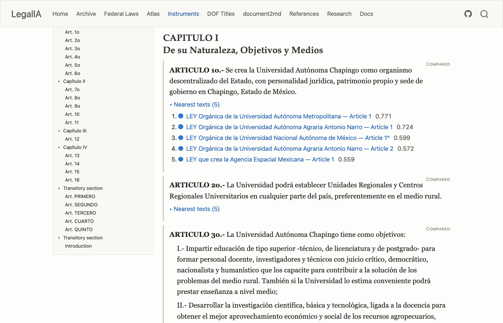{fig-align="center" height=520}
:::

::: {.callout-note icon="false" .column width="38%"}
### La página Instruments

Cada instrumento tiene su esquema, su texto y, para cada fragmento comparado, los cinco textos más cercanos.

::: {.fragment}
Además trae un enlace para comentar el instrumento, y así quien lo lee puede señalar un cruce que no le convence.
:::
:::
::::

# ¿Qué sigue?

## Trabajo pendiente y límites {.fs80}

:::: {.columns}
::: {.callout-tip icon="false" .column}
### Lo que falta

* Un grafo de citas que parta de los decretos del DOF, como el que se construyó para la legislación italiana [@Colombo2025AnLegislation]
* Atlas temporales a partir de las versiones fechadas
* Legislación estatal y jurisprudencia
* Una evaluación con juristas
:::

::: {.fragment .callout-note icon="false" .column}
### El límite

El atlas describe cercanía textual y no mide parentesco jurídico. Es una herramienta para explorar, no una medida validada.
:::
::::

# Conclusiones

## Temas

:::: {.columns}
::: {.column width="50%"}
::: {.callout-tip icon="false"}
### Técnicas

* Inteligencia artificial
* Procesamiento de lenguaje natural
* Representaciones densas y mapas (UMAP)
:::
:::

::: {.column width="50%"}
::: {.callout-tip icon="false"}
### Recursos y tareas

* Cuatro corpus abiertos de la SCJN
* Fragmentos de leyes, reglamentos, lineamientos y tratados
* Atlas de la legislación federal
* Validación con vínculos fuertes y citas
:::
:::
::::

::: {.callout-note icon="false" .fragment}
### Todo es abierto

Paquetes en PyPI, releases con licencia Creative Commons, sitio web y código Apache 2.0 en <https://ingeotec.github.io/LegalIA/>
:::

# Referencias {.fs40}

::: {#refs}
:::

# ¡Gracias!
