## Motivación: Búsqueda por Similitud y Recuperación de Información

La **recuperación de información** (IR) es la disciplina que estudia cómo encontrar información relevante en grandes colecciones de datos, ganado relevancia con la aparición de modelos de lenguaje y sistemas de **Recuperación aumentada por generación (RAG)**.

La **búsqueda por similitud** es un problema algorítmico que esta detrás de la IR eficiente; a su vez, la búsqueda métrica es una formalización matemática que permite construir algoritmos de búsqueda robustos y escalables.

------------------------------------------------------------------------

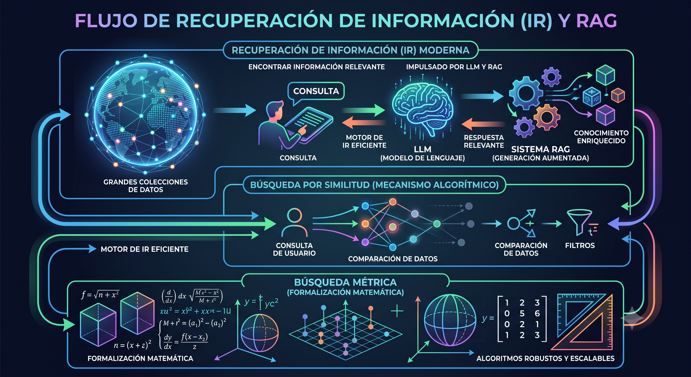{alt="Búsqueda por Similitud y Recuperación de Información"} Imagen generada por Gemini AI (Google)

------------------------------------------------------------------------

{alt="Flujo RAG"} Imagen generada por Gemini AI (Google)

------------------------------------------------------------------------

### Interacción con Grandes Modelos de Lenguaje (LLM) e IR

::: r-fit-text
- **Datos Fuera del Conocimiento:** Las empresas manejan información privada que no formó parte del entrenamiento del modelo.
- **Fine-tuning vs. Recuperación:** El reentrenamiento constante es económicamente prohibitivo y lento. La recuperación de información permite al modelo acceder a datos externos sin necesidad de reentrenamiento.
- **Reducción de Alucinaciones:** Al proporcionar evidencia externa recuperada mediante similitud, se obliga al modelo a basar sus respuestas en hechos verificables.
- **Escalabilidad:** La búsqueda por similitud permite manejar grandes volúmenes de datos, superando las limitaciones de memoria y capacidad de los modelos.
:::

------

::: r-fit-text

### Comunidad

- [SISAP Challenges 2023-2026](https://sisap-challenges.github.io/2026/index.html)
- [Demos](https://sadit.github.io/SimilaritySearchDemos/)

### Datasets 

- [SISAP 2026](https://huggingface.co/datasets/SISAP-Challenges/SISAP2026/)
- [SISAP 2025](https://huggingface.co/datasets/SISAP-Challenges/SISAP2025)

### Paquetes

Tenemos un paquete sobre el tema llamado [`SimilaritySearch.jl`](https://github.com/sadit/SimilaritySearch.jl) que implementa los algoritmos de búsqueda por similitud y recuperación de información.

:::

------------------------------------------------------------------------

## Búsqueda por Similitud

- **Espacios métricos** como un marco de trabajo para *búsqueda por similitud*.

- Búscar elementos *similares* ahora se convierte en elementos *cercanos* bajo una función de distancia métrica$d(x, y)$.

------------------------------------------------------------------------

### Propiedades de la Distancia $d$

Habitualmente se asume que la función de distancia cumple con las propiedades de un **espacio métrico**:

1.  No negatividad: $d(x, y) \ge 0$
2.  Identidad de indiscernibles: $d(x, y) = 0$ entonces $x$ es equivalente a $y$.
3.  Simetría: $d(x, y) = d(y, x)$
4.  Desigualdad triangular: $d(x, z) \le d(x, y) + d(y, z)$

-----

### El problema 

Dado un espacio métrico $(U, d)$, un subconjunto finito $S \subset U$ y un punto de consulta $q \in U$, queremos encontrar los elementos más cercanos a $q$ en $S$.

- Búsqueda por rango
- Búsqueda por k vecinos más cercanos (k-NN)

------------------------------------------------------------------------

:::::: columns
::: {.column width="50%"}
#### Consulta de Rango (Radius Query)

Dado un punto de consulta $q$ y un radio $r$, recuperar todos los objetos $u$ tales que: $$d(q, u) \le r$$
:::

:::: {.column width="50%"}
::: slide-img-container
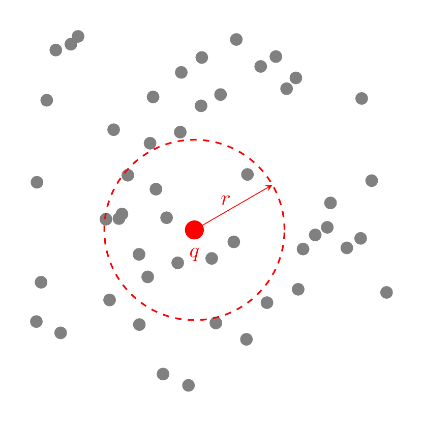{alt="Consulta de Radio (Radius Query)"}
:::
::::
::::::

------------------------------------------------------------------------

:::::: columns
::: {.column width="50%"}
#### Consulta de k vecinos cercanos (k-NN)

Dado $q$ y un entero $k$, recuperar los $k$ objetos más cercanos a $q$ en el dataset.
:::

:::: {.column width="50%"}
::: slide-img-container
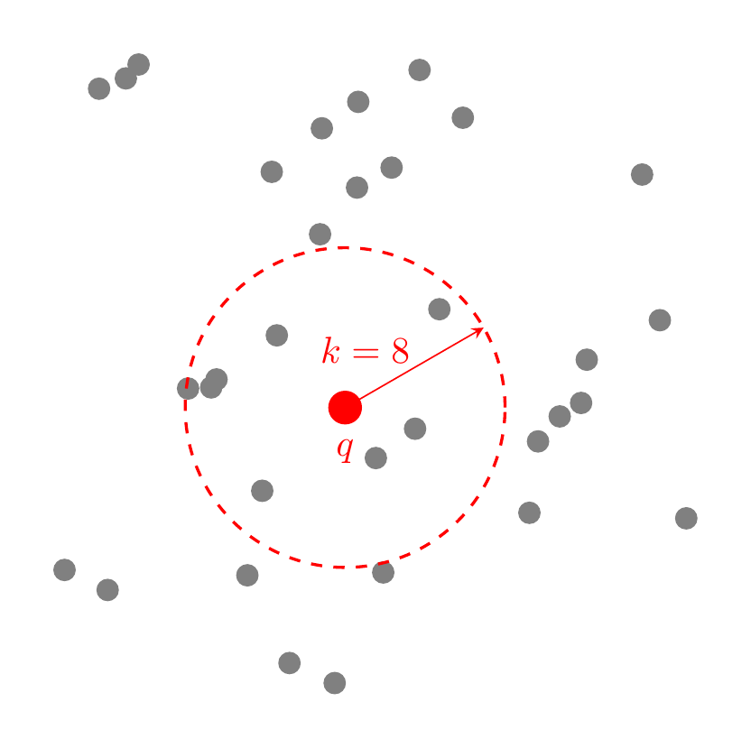{alt="Consulta de k-NN (k-Nearest Neighbors)"}
:::
::::
::::::

------------------------------------------------------------------------

## Indexación por pivotes

Un **pivote** $p$ es un elemento seleccionado del dataset para precalcular distancias a todos los demás elementos. Al recibir la consulta $q$, medimos $d(p, q)$.

### Descarte por desigualdad triangular

Podemos evitar calcular la distancia real a un objeto $x$ usando: $$|d(p, x) - d(p, q)| > r \implies x \notin B(q, r)$$

------------------------------------------------------------------------

### Un pivote

::: slide-img-container
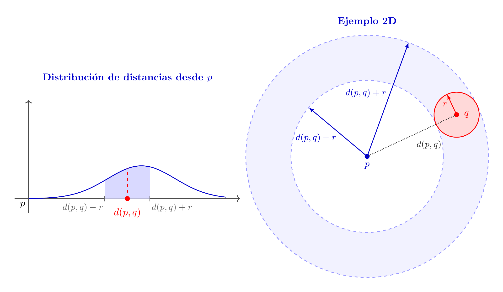{alt="Pruning mediante un pivote"}
:::

------------------------------------------------------------------------

:::::: columns
::: {.column width="50%"}
### Múltiples pivotes

Al usar un conjunto de pivotes $\{p_1, p_2, \dots, p_k\}$, cada uno define un anillo de búsqueda permitido. Un elemento $x$ solo se evalúa si sobrevive a la regla de descarte para **todos** los pivotes:

$$\bigcap_{i=1}^k [d(p_i, q) - r, d(p_i, q) + r]$$
:::

:::: {.column width="50%"}
::: slide-img-container
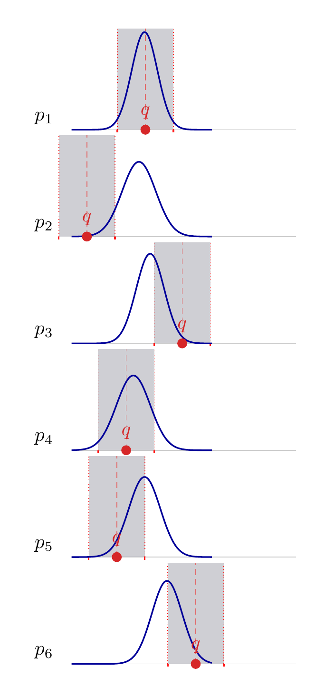{alt="Intersección con múltiples pivotes"}
:::
::::
::::::

------------------------------------------------------------------------

## Particiones compactas del espacio

::: slide-img-container
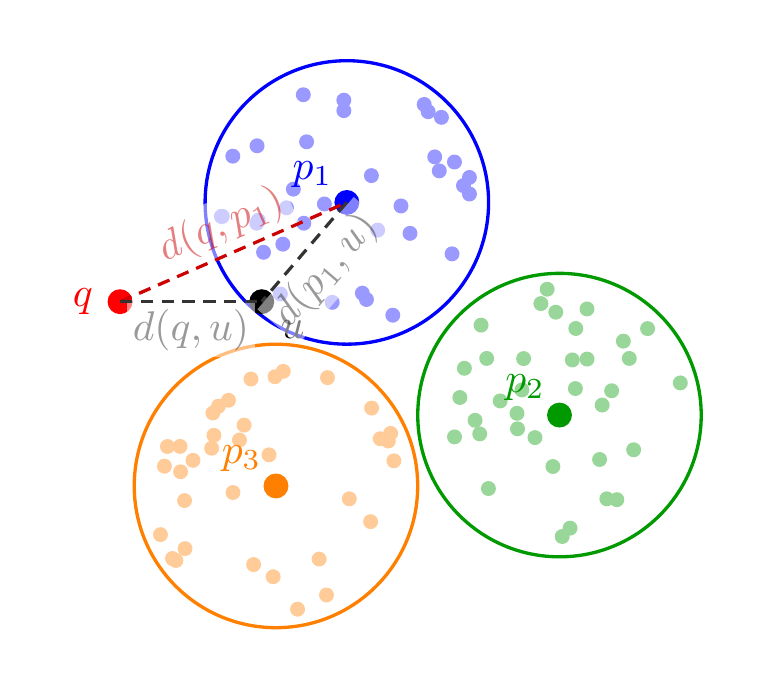{alt="Particiones compactas e inecuación triangular"}
:::

------------------------------------------------------------------------

## Métodos aproximados

En el peor caso, los índices de búsqueda se reducen a una búsqueda sequencial. Por lo tanto, se han desarrollado métodos aproximados que sacrifican la exactitud por velocidad y eficiencia de memoria.

------

## Cuantización

::: slide-img-container
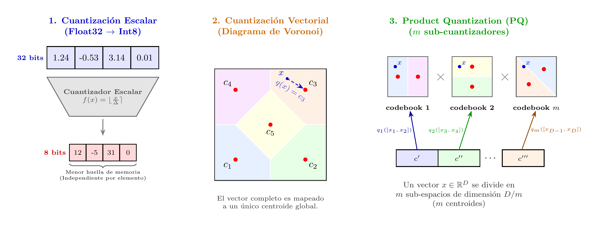{alt="Esquemas de Cuantización (SQ, VQ, PQ)"}
:::

## Poda agresiva

::: slide-img-container
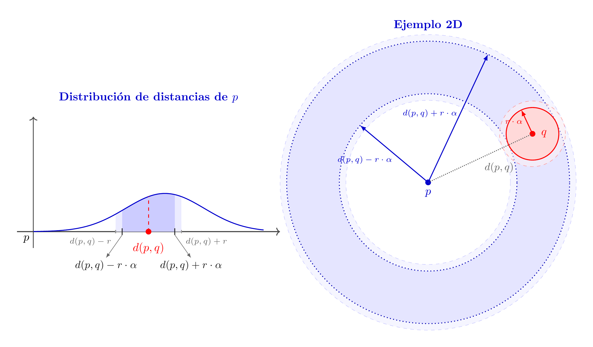{alt="Probabilistic spell"}
:::

## Locality Sensitive Hashing (LSH)

::: slide-img-container
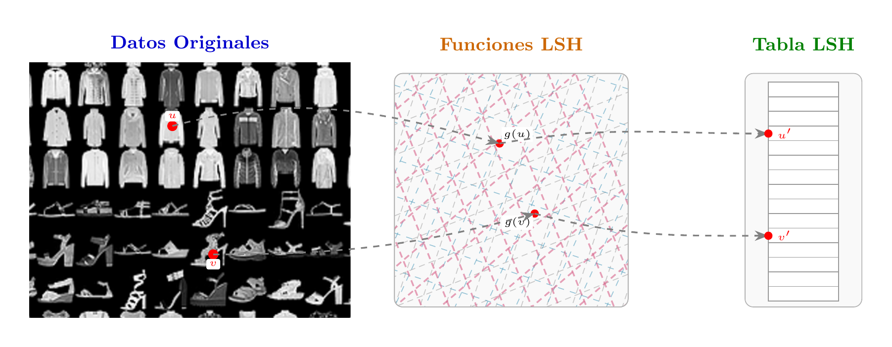{alt="Esquema de indexación LSH"}
:::

------------------------------------------------------------------------

## Grafos de proximidad

Los datos se indexan como nodos en un grafo. Dos nodos están conectados si son espacialmente vecinos según un criterio de proximidad.

- Robustos a la *maldición de la dimensionalidad*.
- Permiten una búsqueda $\log^\alpha n$ mediante navegación dirigida.
- Se adaptan de forma natural a la topología y densidad local de los datos.

Se basan en un concepto que aparece llamado **monotonía**.

------------------------------------------------------------------------

::: slide-img-container
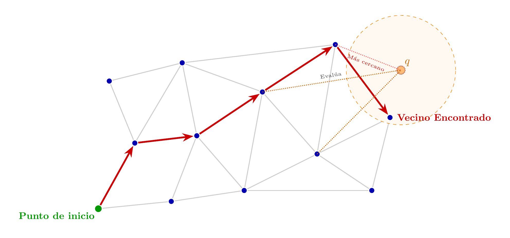{alt="Estructura básica de un grafo de proximidad"}
:::

------------------------------------------------------------------------

::: slide-img-container
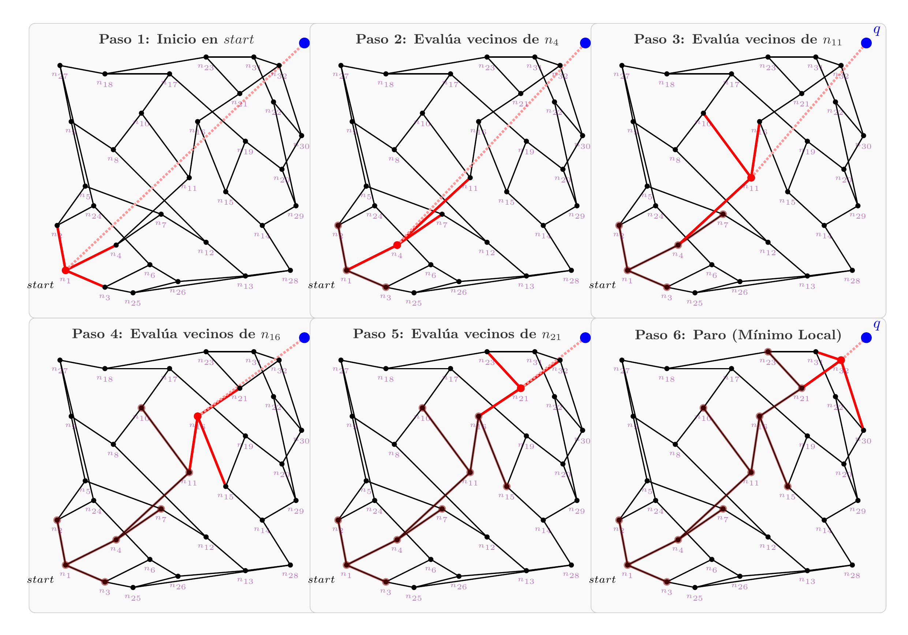{alt="Paso a paso de la búsqueda codiciosa en grafos"}
:::

------------------------------------------------------------------------

::: slide-img-container
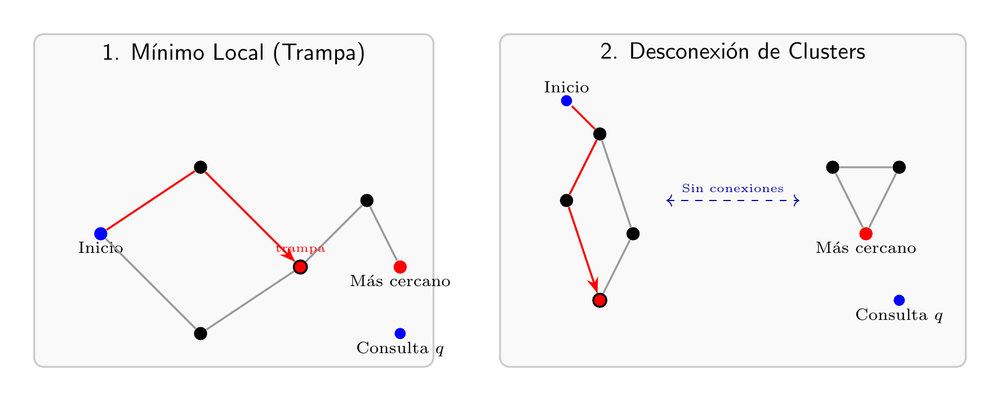{alt="Problemas de mínimos locales y desconexión"}
:::

------------------------------------------------------------------------

## Comparativa de topologías de grafo

::: slide-img-container
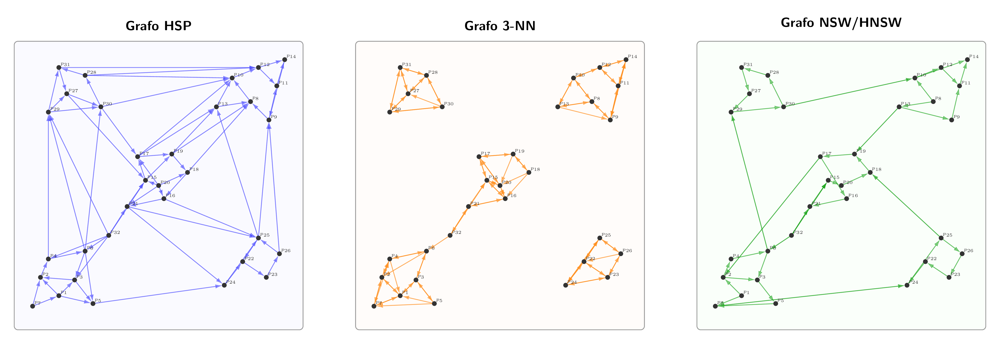{alt="Comparativa visual entre HSP, 3-NN y NSW/HNSW" width="2000"}
:::

------------------------------------------------------------------------

### Estructuras Jerárquicas

::: slide-img-container
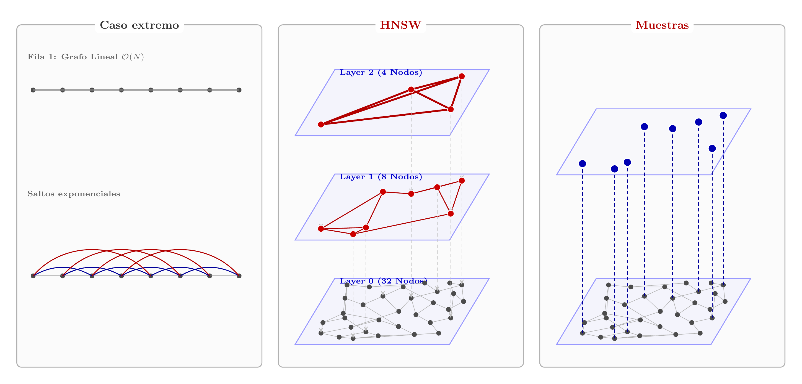{alt="Esquema multicapa"}
:::

------------------------------------------------------------------------

### Construcción Incremental

::: slide-img-container
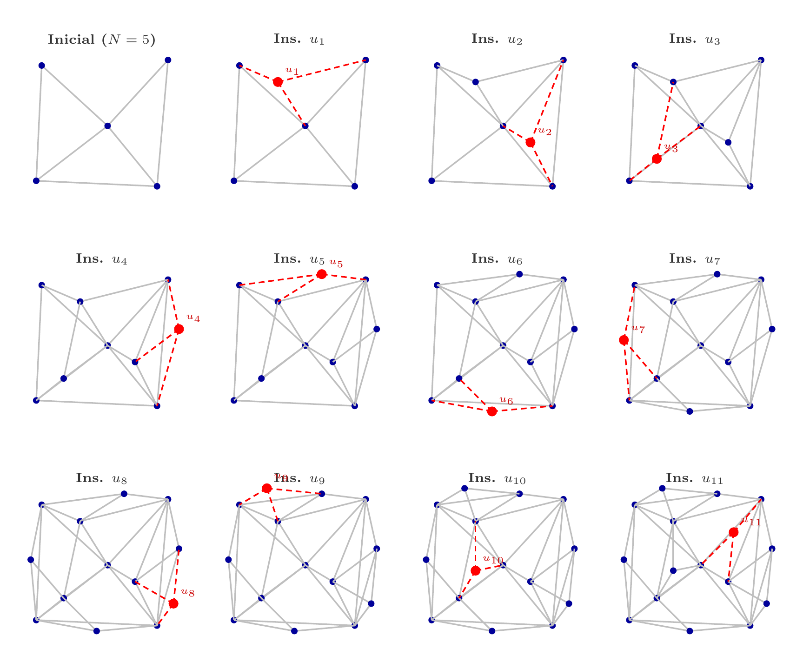{alt="Construcción e inserción de nuevos nodos"}
:::

------------------------------------------------------------------------

## Nuestra investigación

El ajuste fino de los índices métricos es una tarea computacionalmente costosa que requiere de un experto en la técnica para ejecutar el trabajo; mencionando las dificultades para lograr índices de alta calidad con búsquedas de alta velocidad mientras se mantienen bajos los requisitos de memoria.

Nuestra investigación en este ámbito va sobre algoritmos *eficientes* pero también que se *autoconfiguran*.

------------------------------------------------------------------------

### Algoritmo beam-search modificado

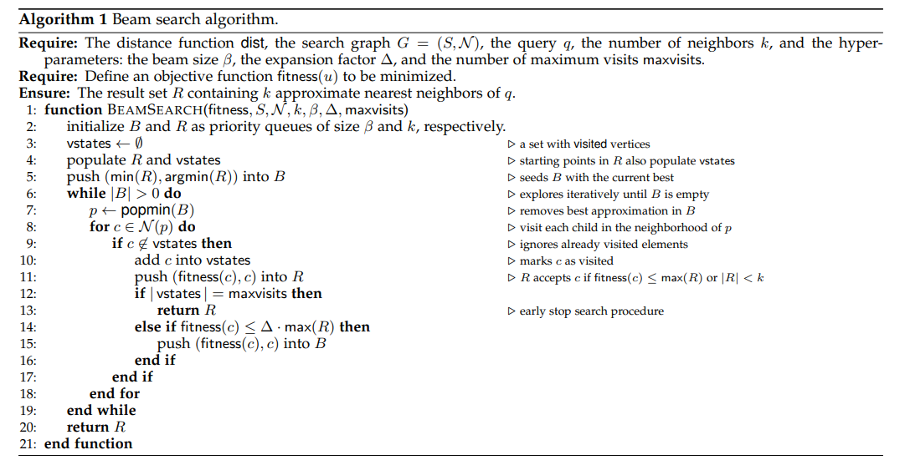{alt="Algoritmo de búsqueda"}

------------------------------------------------------------------------

- Nuestro algoritmo de búsqueda necesita un par de parámetros $\beta$ y $\Delta$, los cuales administran la exploración del grafo
- Esto se hace con la construcción **en línea** (y post-construcción) con la ayuda de una función de aptitud (*fitness function*).

------------------------------------------------------------------------

### Definición del grafo de configuraciones

::: r-fit-text
En esta tarea de optimización, el grafo de hiperparámetros es $H=(C, \mathcal{M})$ donde $C\subset\mathbb{N} \times \mathbb{R}^+$ es el dominio de $\beta$ y $\Delta$, y el conjunto de aristas $\mathcal{M}$ es la unión de todos los vecinos de cualquier configuración dada $c$, es decir, $\{ c \leftrightarrow c' \mid c' \in \mathcal{N}(c) \}$. El grafo $H$ no se almacena de forma explícita y se genera con reglas simples basadas en algoritmos evolutivos; consulte \cite{BurkeKendall2014} y \cite{Sloss2020}. En este sentido, definimos tres operadores genéticos diferentes que trabajan en el espacio de configuración $C$:

- $\textsf{rand}(C)$: realiza un muestreo del espacio de configuración $C$, es decir, selecciona aleatoriamente valores válidos de $\beta$ y $\Delta$.
- $\textsf{crossover}((\beta_1, \Delta_1), (\beta_2, \Delta_2))$: combina dos configuraciones para crear una nueva.
- $\textsf{mutate}((\beta, \Delta), C)$: modifica ligeramente $\beta$ y $\Delta$ para crear una nueva configuración que esté cerca de la original y dentro de los límites de $C$.
:::

------------------------------------------------------------------------

### Función *fitness*

::: r-fit-text
Primero definamos la función $\textsf{recall}$ que mide la calidad de una solución de consultas de una recuperación de $k$ vecinos cercanos.

\begin{align*}
    \textsf{recall}(q_i) &= \frac{\# \text{ of real } k \text{ nearest neighbors for } q_i}{k} \\
     &= \frac{|\text{gold result } q_i \cap \text{result } q_i |}{|\text{gold result } q_i|} 
\end{align*}

y definimos como $$\textsf{recall}(Q) = \frac{1}{\#Q}\sum_{q \in Q} \textsf{recall}(q)$$

**El recall entonces varia entre 0 y 1**
:::

------------------------------------------------------------------------

### Función *fitness* (cont.)

::: r-fit-text
- Precisión: en lugar de una función de aptitud definiremos una función de error.
- Definamos *min-r* como el recall objetivo para configurar.
- Sea $r = \textsf{recall}(Q)$, calculado con el grafo $G$ y $(\beta, \Delta)$.
- Sea $cost$ el costo medido para resolver $Q$ (medido en el proceso de calcular $\textsf{recall}$)

Ahora sí, dada una muestra de consultas $Q$, un grafo $G$

\begin{equation}
  \textsf{error}(G, (\beta, \Delta), Q) = \\
  \begin{cases}
    1 + (\text{min-r} - r) & 
        \text{if } r < \text{min-r} \\
    \frac{cost}{\# \text{ of metric objects}}  & \text{otherwise}
  \end{cases}
\end{equation}
:::

------------------------------------------------------------------------

## Costos

::: r-fit-text
- [@malkov2014approximate] argumenta que el NSW tiene cada búsqueda cuesta $\log^3(n)$
- [@malkov2018efficient] dice que es $O(\log n)$ ya que supone constantes la vecindad y los parametros de su jerarquía, todo esto para un recall fijo no especificado y una $n$ fija, además de probado en un espacio ecuclideano de dimensión 4.
- [@hezel2024] conjetura que su costo de búsqueda esta acotado por una suma de terminos sublineales y logarítmicos.
:::

------------------------------------------------------------------------

### Costo (cont...)

::: r-fit-text
Nuestro análisis es más detallado ya que no supone una $n$ o $\mathcal{N}$ fijas; aunque también hay algunas consideraciones:

- $\mathcal{N} \leq \log_B(n)$, es menor que porque se filtran mediante el HSP.
- En lugar de una jerarquía como el HNSW usamos una muestra de tamaño $O(\log N)$ que llamamos HINTS.

Por lo que los costos de búsqueda quedan como:

\begin{equation}
    \textsf{search-cost}(n) = O(\log n) + \sum_{u\in P} |\mathcal{N}(u)|;
    \label{eq/search-cost}
\end{equation}

donde $P$ es el camino recorrido para resolver una consulta y $\mathcal{N}(u)$ es la vecindad conectada al nodo $u$.

Otro punto importante es que no vemos el recall como una constante natural al índice.
:::

------------------------------------------------------------------------

### Costo (cont...)

::: r-fit-text
- El costo se limita a un polilogaritmo con un único termino que se nos puede ir de las manos: $|P|$
- Conjeturamos que $P$ esta determinado por la dimensión, la consulta, y la calidad esperada.

Dado que tenemos muchos datos, podemos determinar de manera experimental los costos suponiendo que $\textsf{search-cost}(n)=\log_2^\alpha(n)$ para un $\alpha$; para esto usaremos ajuste a la siguiente expresión de costo:

\begin{equation}
\textsf{search-cost}(n) = \log_2^\alpha(n) = \log(n) + \sum_{u\in P} |\mathcal{N}(u)| \label{eq/fit-cost}. 
\end{equation}

También buscamos caracterizar $P$ por lo que suponemos $|P| = \log_2^\gamma(n)$.
:::

------------------------------------------------------------------------

## Desempeño en una diferentes tipos de distancias {.scrollable}

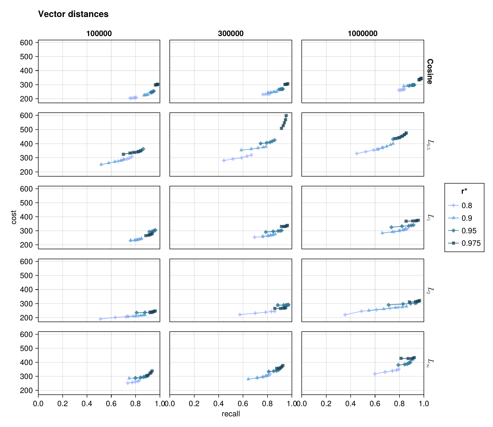{width="100%"}

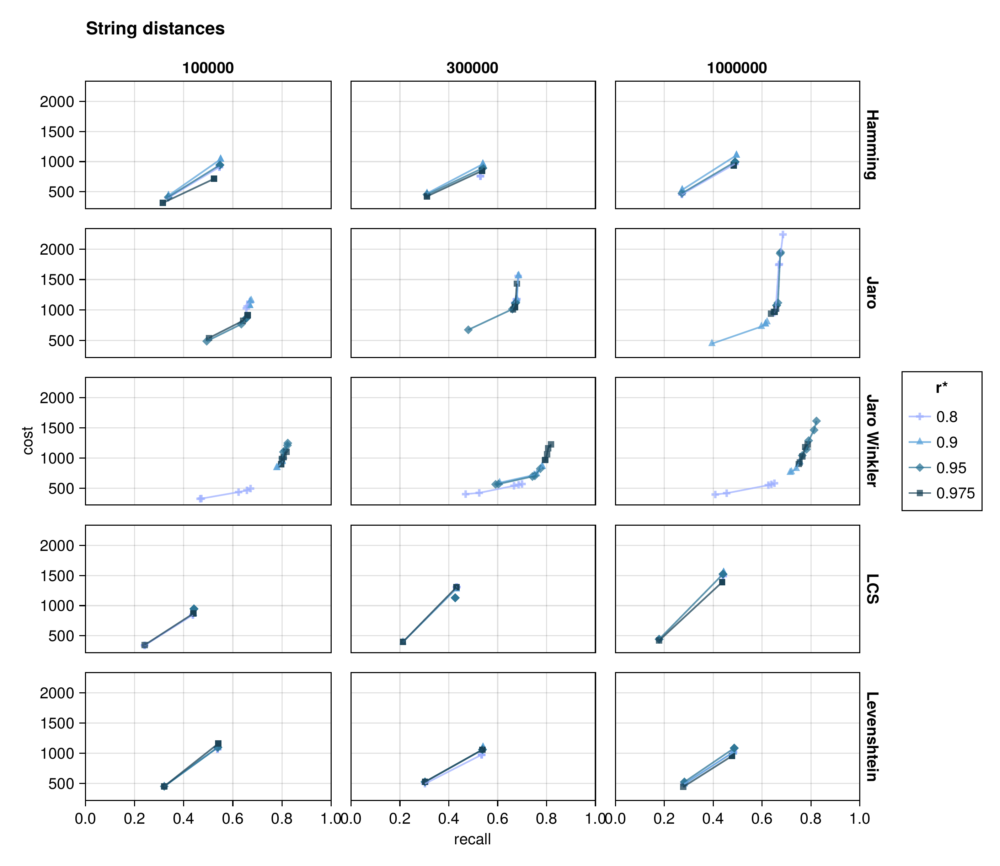{width="100%"}

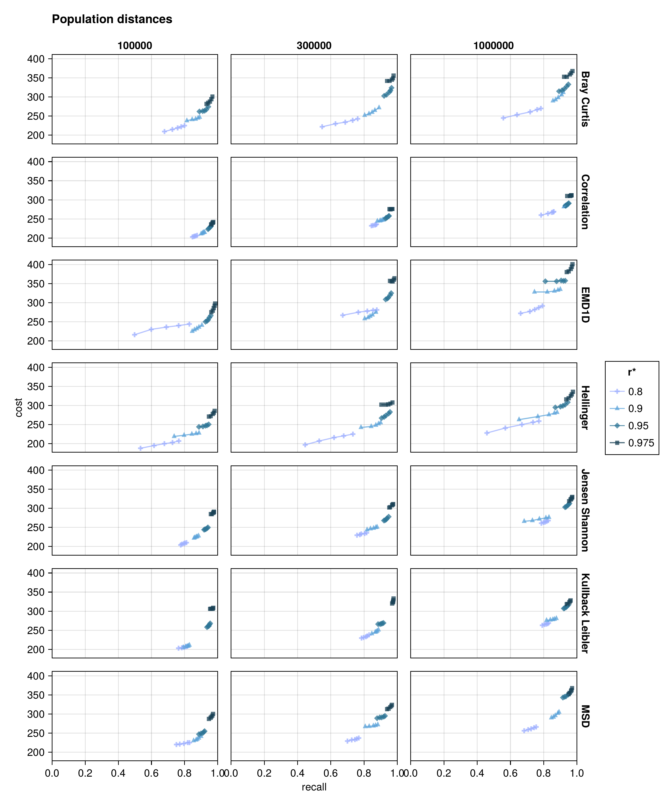{width="100%"}

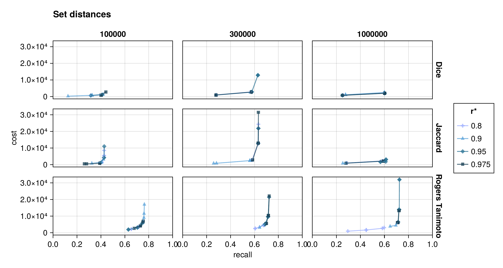{width="100%"}

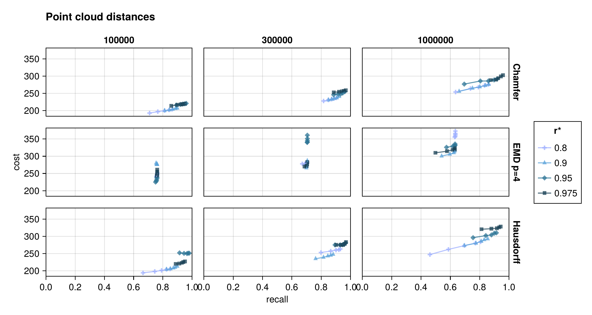{width="100%"}

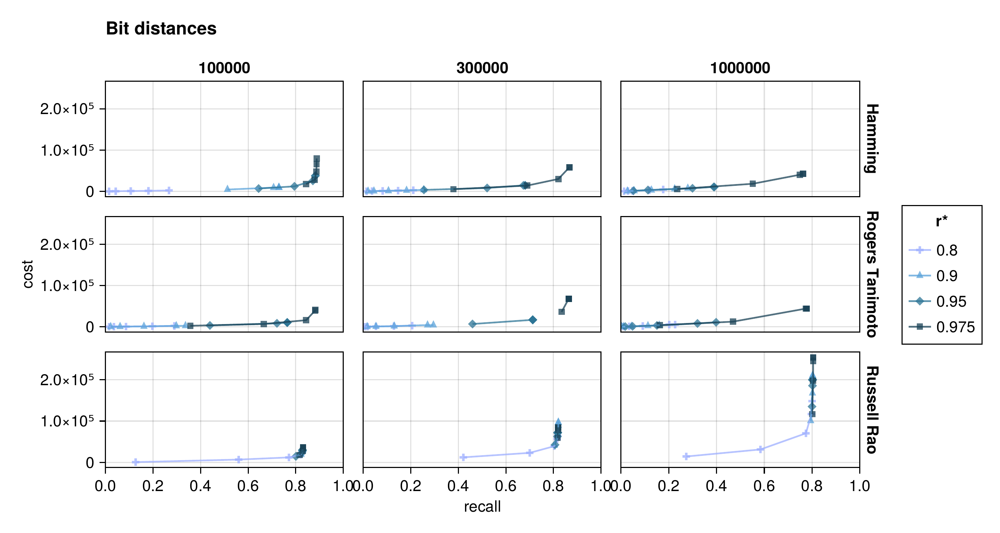{width="100%"}

------------------------------------------------------------------------

### Ajuste costo vs. n

::: slide-img-container
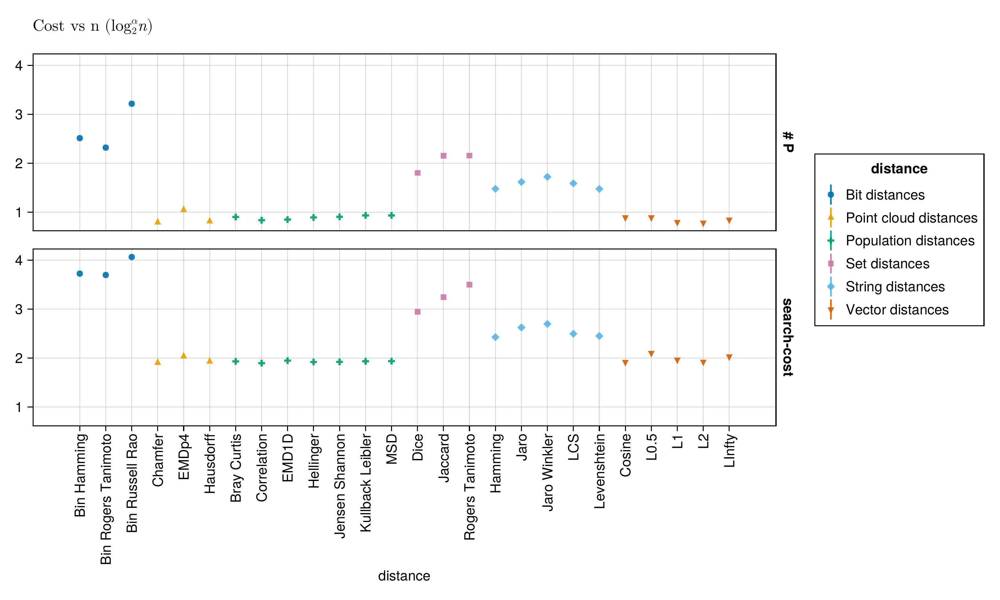
:::

------------------------------------------------------------------------

### Desempeño sobre la DB datos real LAION

#### SISAP Indexing Challenge 2023-2024

::: slide-img-container
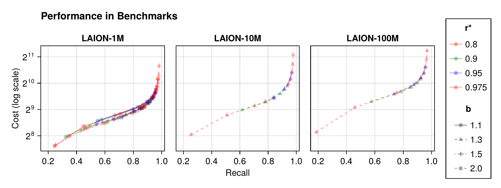
:::

------------------------------------------------------------------------

### LAION (SISAP)

#### Ajuste costo vs. n

|      b |    tcost |   coef | stderror | margin of error |
|-------:|---------:|-------:|---------:|----------------:|
| 1.3000 | $\alpha$ | 1.1575 |   0.0097 |          0.0192 |
| 1.3000 | $\gamma$ | 0.2352 |   0.0135 |          0.0268 |

------------------------------------------------------------------------

### Efecto de la cuantización (costo)

::: slide-img-container
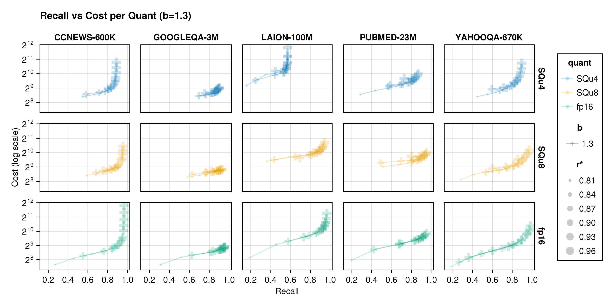
:::

------------------------------------------------------------------------

### Efecto de la cuantización (throughput q/s)

::: slide-img-container
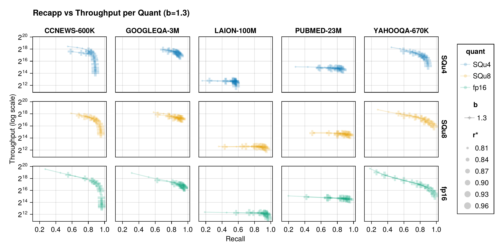
:::

------------------------------------------------------------------------

### Efecto de la cuantización

:::::: columns
::: {.column width="30%"}
Ajuste para recall $\log_2^{c+recall}(n)$
:::

:::: {.column width="70%"}
::: slide-img-container
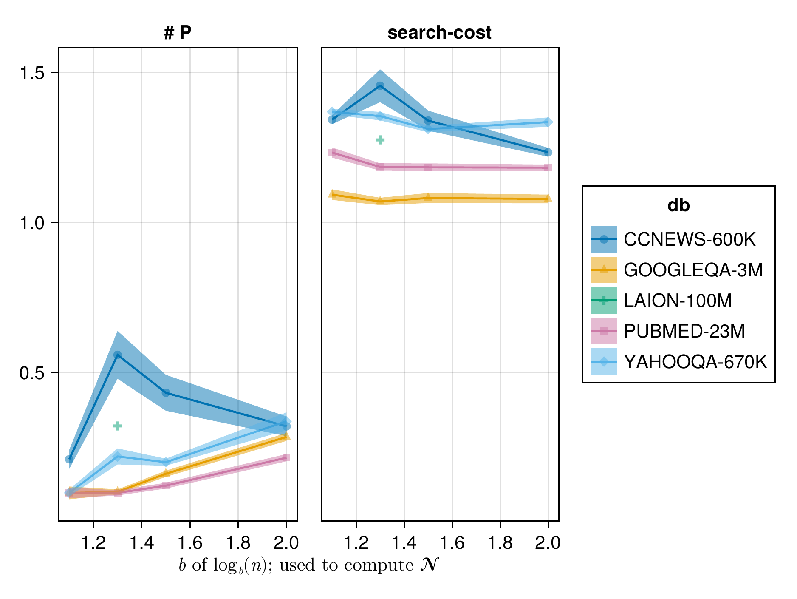
:::
::::
::::::

------------------------------------------------------------------------

## Comparación con el estado del arte

#### Datos SISAP 2023, 2024, 2025, otros

::: slide-img-container
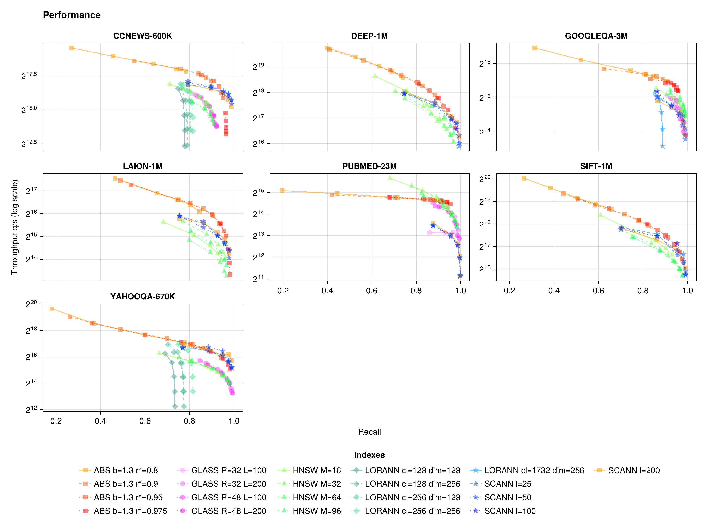
:::

------------------------------------------------------------------------

### Conclusión

La elección del índice depende del balance entre **memoria, tiempo de consulta y recall (exactitud)**. En la actualidad, los grafos de proximidad jerárquicos combinados con cuantización constituyen el estado del arte para sistemas de búsqueda vectorial de alto rendimiento.

## Gracias

::: r-fit-text

- [SISAP Challenges 2023-2026](https://sisap-challenges.github.io/2026/index.html)
- [Demos](https://sadit.github.io/SimilaritySearchDemos/)
- [SISAP 2026](https://huggingface.co/datasets/SISAP-Challenges/SISAP2026/)
- [SISAP 2025](https://huggingface.co/datasets/SISAP-Challenges/SISAP2025)
- [`SimilaritySearch.jl`](https://github.com/sadit/SimilaritySearch.jl) 

:::

## Referencias

::: {#refs}
:::

