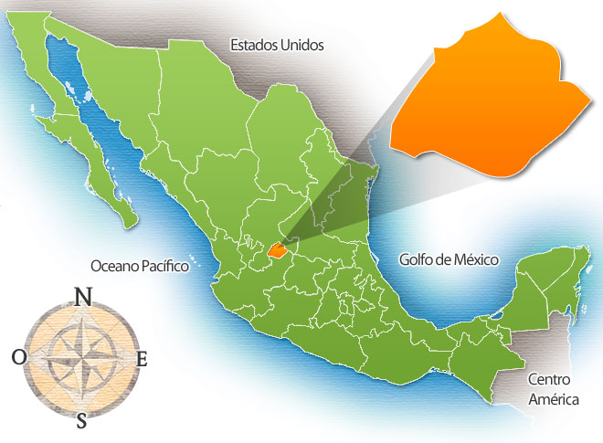
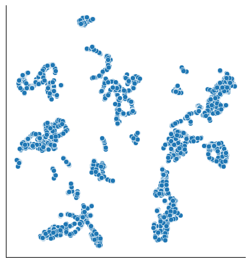
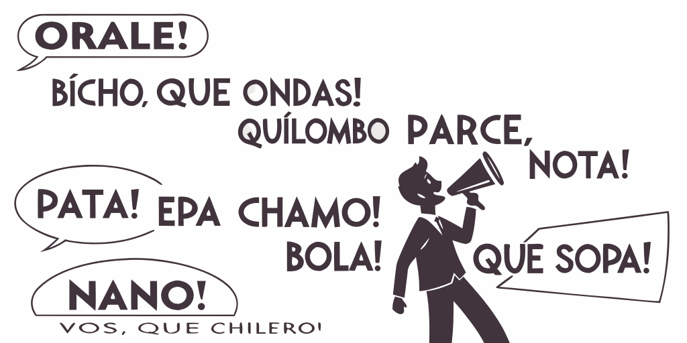
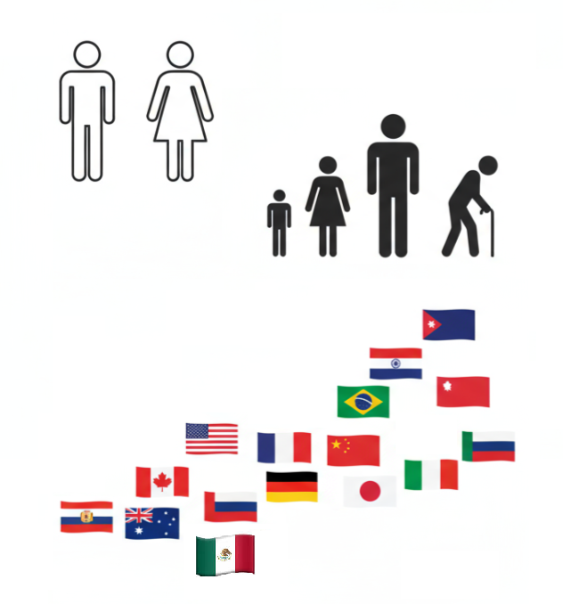
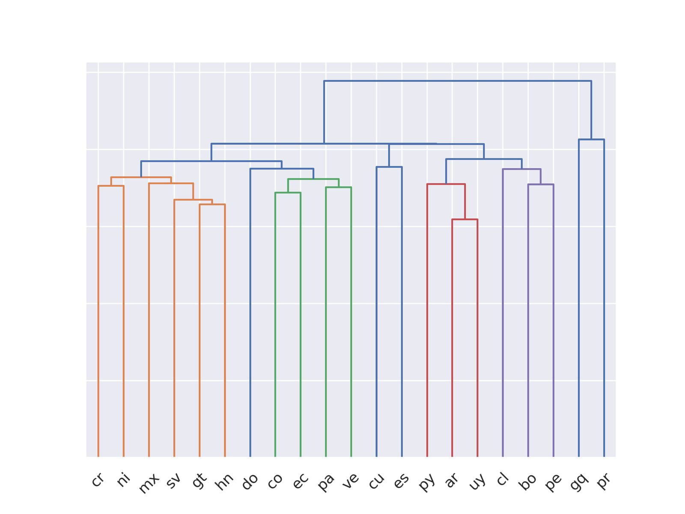
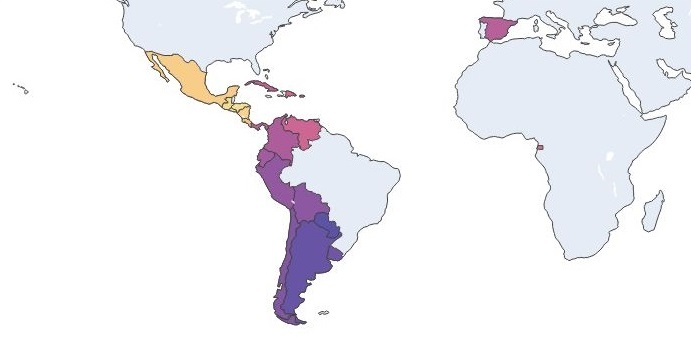

```{python}
#| include: false
import country_converter as coco
from scipy.stats import multivariate_normal
from sklearn import decomposition, tree
from sklearn.datasets import load_iris
from sklearn.svm import LinearSVC
import plotly.express as px
import plotly.graph_objects as go
import re
import pandas as pd
import numpy as np
import seaborn as sns
from encexp.download import download
```

## Aguascalientes, México

:::: {.columns} 
::: {.column width="50%"} 

:::

::: {.fragment .callout-note icon="false" .column width="50%"} 
### INFOTEC 

Centro de Investigación del Gobierno Federal, que contribuye a la Transformación Digital de México, a través de la investigación, la innovación, la formación académica y el desarrollo de productos y servicios TIC. Sus alcances abarcan al sector público y privado, habilitando caminos que conduzcan hacia un México moderno y de inclusión digital.
:::
::::

# Introducción 

## Definiciones 

:::: {.columns}
::: {.callout-note icon="false" .column} 
### Inteligencia Artificial (IA)

Conjunto de teorías, métodos y algoritmos para el desarrollo y estudio de sistemas que presentan un comportamiento que sería identificado como inteligente.
:::

::: {.fragment .callout-note icon="false" .column}
### Aprendizaje Computacional  

Subárea de IA que estudia el desarrollo e implementación de algoritmos capaces de aprender de datos de manera autónoma sin haber sido explícitamente programados. 
:::
::::

::: {.fragment .callout-note icon="false"} 
### Procesamiento de Lenguaje Natural

Conjunto de teorías, métodos y algoritmos para el desarrollo y estudio de sistemas que permitan el entendimiento, generación y manipulación del lenguaje humano.
:::

## Percepción de Inteligencia Artificial (IA)

:::: {.columns}

::: {.callout-tip icon="false" .column width=50%}
### Así la vemos

{height=300}
:::

::: {.fragment .callout-tip icon="false" .column width=50%}
### Así está

{fig-align="left" height="300px"}
:::
::::

# Minería de opinión 

## Minería de opinión @dave2003mining

::: {.callout-note icon="false"} 
### Definición @liu2012sentiment

Estudia las opiniones, valoraciones, actitudes y emociones de las personas hacia entidades, individuos, eventos y sus atributos. 
:::

:::: {.columns}
::: {.column width="50%"}
::: {.callout-note icon="false" .fragment}
### Definición formal 

* $e_i$ -       Entidad
* $a_{ij}$ -    Aspecto of $e_i$
* $o_{ijkl}$ -  Orientación de la opinión 
* $h_k$ -       Fuente de la opinión
* $t_l$ -       Tiempo
:::
:::
::: {.column width="50%"}
::: {.callout-tip icon="false" .fragment}
### Entidad 

Producto, servicio, persona, evento, organización o tópico.
:::

::: {.callout-tip icon="false" .fragment}
### Aspecto 
Componente o atributo de la entidad
:::
:::
::::

## Tareas de la minería de opinión 
:::: {.columns}
::: {.column width="60%"}
::: {.callout-tip icon="false"}
### Tareas  
* Identificación de la entidad 
* Identifación de los aspectos / considerando la entidad 
* Fuente de la opinión y tiempo
* Orientación de la opinión
:::
:::
::: {.column width="40%"}
{fig-align="center" width="300px"}
:::
::::

# Aprendizaje computacional

## Aprendizaje computacional 

::: {.callout-note icon=false}
### Tipos de aprendizaje computacional

* Aprendizaje no supervisado
* Aprendizaje supervisado
* Aprendizaje por refuerzo
:::

:::: {.columns}

::: {.fragment .callout-tip icon="false" .column}
### Aprendizaje no supervisado

{fig-align="center" height=253}
:::

::: {.fragment .callout-tip icon="false" .column}
### Aprendizaje por refuerzo

* Juegos
* Actividades
* Retroalimentación al final 
:::
::::

## Aprendizaje supervisado

::: {.callout-tip icon="false"}
### Clasificador lineal

```{python}
#| echo: false
D, y = load_iris(return_X_y=True)
pca = decomposition.PCA(n_components=2).fit(D)
Dn = pca.transform(D)
df = pd.DataFrame(Dn, columns=['x', 'y'])

df['Class'] = ['P' if i == 0 else 'N' for i in y]
m = LinearSVC(dual='auto').fit(Dn, [1 if i == 0 else 0 for i in y])
w_1, w_2 = m.coef_[0]
w_0 = m.intercept_[0]
g_0 = [dict(x1=x, x2=y, tipo='g(x)=0')
       for x, y in zip(Dn[:, 0], (-w_0 - w_1 * Dn[:, 0]) / w_2)]
line = go.Scatter(x=Dn[:, 0], y=(-w_0 - w_1 * Dn[:, 0]) / w_2,
                  line=dict(color='darkgrey'),
                  showlegend=False)
fig = px.scatter(df, color='Class', x='x', y='y', height=400)

fig.update_layout(yaxis={'visible': True, 'showticklabels': False}, 
                  xaxis={'visible': True, 'showticklabels': False},
                  xaxis_title=None, yaxis_title=None)
fig.add_trace(line)
fig.show()
```
::: 

## Algoritmos evolutivos 
:::: {.columns}
::: {.column width="40%"}
::: {.callout-note icon="false"}
### Definición 
Algoritmos de búsqueda aleatoria inspirados en fenómenos naturales, como la supervivencia del más apto y la herencia, utilizados para resolver problemas de optimización. 
:::
:::
::: {.column width="60%"}
{fig-align="center" width="450px"}
:::
::::


# Aplicaciones de Procesamiento de Lenguaje Natural

## Aplicaciones de PLN (1/2)
:::: {.columns}

::: {.column}


{fig-align="center" }
:::

::: {.callout-tip icon="false" .column}
### Aplicaciones

- **Minería de opinión**
  - <span style="color: rgb(0, 0, 255);">positivo :) </span> --<span style="color: rgb(130, 130, 130);">neutro :|</span> --<span style="color: rgb(255, 0, 0);">negativo :( </span>
- **Análisis de tópicos**
- **Carga emotiva de un mensaje**: _enojo, anticipación, disgusto, miedo, gozo, tristeza, sorpresa, confianza_.
- **Identificación de humor**
- **Identificación de lenguaje de odio**
:::
::::


## Aplicaciones de PLN (2/2) {style='font-size: 80%;'}
::::{.columns}
::: {.callout-tip icon="false" .column}
### Aplicaciones
- **Predicción indicadores socio-demográficos de usuarios de redes**, e.g., edad, sexo, lugar de procedencia, ocupación
- **Identificación de autoría**: ¿quiénes escriben?, ¿cómo escriben?, ¿sobre qué escriben?
- **Entender como se comportan usuarios**, ¿qué desean?, ¿por qué?
- **Medición de discurso de odio en redes sociales**, e.g., xenofobia, racismo, misoginia, cyberbulling.
- **Identificación de posibles trastornos mentales**, e.g., ansiedad, depresión, adicciones.
- **Aplicaciones** a seguridad, salud, políticas públicas, economía y finanzas.
:::
::: {.column}
{fig-align="center" }
:::
::::

## Algunos retos
::::{.columns}
::: {.callout-tip icon="false" .column}
### Retos
- Escritos informales: muchos errores, onomatopeya, importación de términos, variaciones regionales, emojis, entre muchos otros.
- Contextos cortos, conocimiento del mundo.
- Negación, sarcasmo, ironía, humor.
- Semántica.
- Recursos lingüísticos reducidos para lenguajes diferentes del inglés.
- Multimedios.
:::
:::{.column}
{fig-align="center" }
:::
::::

<!-- ## Regionalización
::: {style='background-color: rgb(200,250,250);'}
Todo lo anterior puede regionalizarse, ya que un mismo lenguaje puede usarse de manera diferente en diferentes regiones.
:::
::: {style='background-color: rgba(255, 255, 255, 1);'}
{fig-align="center" height="200"}
:::
::: {style='background-color: rgb(250,200,250);'}
Para tareas dónde haya una fuerte carga cultural o de idiosincrasia el uso de recursos regionalizados es provechoso.
::: -->

# Clasificación de Textos 

## Clasificación de Textos

::: {.callout-note icon=false} 
### Definición 

El objetivo es la **clasificación** de **documentos** en un número fijo de categorías predefinidas.
:::

::: {.callout-tip icon=false .fragment} 
### Polaridad 
El día de mañana no podré ir con ustedes a la librería
:::

::: {.fragment style="font-size: 100%; text-align: center;"} 
**Negativa**
:::

## Tareas de Clasificación de Textos
:::::{.columns}
::::{.column}
::: {.callout-tip icon=false} 
### Polaridad 
Positiva, Negativa, Neutral
:::

::: {.callout-tip icon=false} 
### Emoción (Multiclase) 

* Ira, Alegría, ...
* Intensidad de una emoción
:::

::: {.callout-tip icon=false} 
### Evento (Binaria) 

* Violento
* Delito
:::
::::
::::{.column}
{fig-align="center"}
::::
:::::

## Perfilado de autores
:::::{.columns}
::::{.column}
::: {.callout-tip icon=false} 
### Género 

Hombre, Mujer, No binario, ...   
:::

::: {.callout-tip icon=false} 
### Edad 

Niño, Adolescente, Adulto
:::

::: {.callout-tip icon=false} 
### Variedad de Lenguaje 

* Español: España, Cuba, Argentina, México, ...
* Inglés: Estados Unidos, Inglaterra, ...
:::
::::
::::{.column}
{fig-align="center" height="500"}
::::
:::::

# Modelado medianate bolsa de palabras 

## Representación de Texto 

:::: {.columns} 
::: {.callout-tip icon="false" .column} 
### Bolsa de palabras 

* Asociar cada palabra a un identificador.
  * de $\rightarrow$ 1. 
  * que $\rightarrow$ 2. 
  * buenos $\rightarrow$ 216. 
  * dias $\rightarrow$ 101. 
::: 

::: {.column} 
::: {.fragment .callout-tip icon="false"} 
### buenos días 

$(216, 101)$
:::

::: {.fragment .callout-tip icon="false"} 
### La bolsa no tiene orden 

$(101, 216)$
:::
:::
::::

:::: {.columns} 
::: {.fragment .callout-tip icon="false" .column} 
### Modelo lineal 

$y = \sigma( \sum_{i \in (100, 215)} w_i x_i + w_0)$
:::

::: {.fragment .callout-tip icon="false" .column}
### Parámetros 

$x_i$ TFIDF / $w_i$ valor estimado 
:::
::::

## Representación de Texto (2) 

:::: {.columns} 
::: {.callout-tip icon="false" .column}
### Bolsa de Palabras / Limitantes 

* No existe similitud entre palabras.
* Se pierde el orden.
* Vector disperso.
:::

::: {.fragment .callout-tip icon="false" .column}
### Embeddings estáticos

* Hipótesis distribucional.
* Similitud entre palabras.
* Vector denso.
:::
::::

::: {.fragment .callout-tip icon="false"}
### Embeddings estáticos / limitantes

* Se pierde el orden.
* Independientes del contexto.
:::


# Dialect Identification (DialectId) 

## Datos 

:::: {.columns} 
::: {.callout-tip icon="false" .column width="70%"}
### Datos georeferenciados en español 

```{python}
#| echo: false

def distribution_by_time(lang):
    """Original distribution by time"""
    df = pd.read_json(download(f'{lang}_info', return_path=True))
    df.drop(columns=['ALL'], inplace=True)
    color = [x for x in sns.color_palette('Set1')][:5]
    todos = df.sum(axis=0).sort_values(ascending=False).index.tolist()
    superior = todos[:19]
    columns_desc = coco.convert(superior, to='name_short')
    inferior = todos[19:]
    if len(inferior):
        df['Rest'] = df[inferior].sum(axis=1)
        superior.append('Rest')
        columns_desc.append('Rest')
    hue_order = columns_desc
    df = df[superior]
    df.columns = columns_desc
    dashes = []    
    for dash in ['', (1, 10), (5, 5), (1, 1)]:
        dashes.extend([dash] * len(color))
    dashes = (dashes * int(1 + len(hue_order) / len(dashes)))[:len(hue_order)]
    color = (color * int(1 + len(hue_order) / len(color)))[:len(hue_order)]
    df2 = df.rolling(window=7).mean()
    df2.dropna(inplace=True)
    # df2 = df2.divide(df2.sum(axis=1), axis=0)
    df2 = df2.melt(ignore_index=False, value_name='Number of tweets',
                   var_name='Country')
    df2.reset_index(inplace=True, names='Date')
    fig = sns.relplot(df2, kind='line', x='Date',
                      hue_order=hue_order, style_order=hue_order,
                      palette=color,
                      dashes=dashes, y='Number of tweets',
                      style='Country', hue='Country')
    return fig

distribution_by_time('es')
```  
::: 

::: {.column width="30%"}
::: {.callout-tip icon="false" .fragment} 
### ¿Qué se puede hacer con los datos? 

* Muchos textos
* Cada texto asociado a un pais
::: 

::: {.callout-tip icon="false" .fragment} 
### Problema 

* Clasificación de texto
::: 
:::
:::: 


## DialectId 
::: {.callout-note icon=false}

### ¿Qué es?
DialectId es un clasificador de texto basado en una representación de *Bolsa de Palabras* (BoW, por sus siglas en inglés, Bag of Words), utilizando SVM lineal como clasificador.
:::

:::: {.columns}
::: {.fragment .callout-tip icon="false" .column}
### Procesamiento de normalización

* Caracteres en minúsculas
* Eliminar lo diacríticos
* Remplazar nombres de usuario por "_usr"
* Remplazar URLs por "_url"
:::

::: {.fragment .callout-tip icon="false" .column}
### Conjunto entrenamiento

Los tokens y sus pesos fueron estimados usando un conjunto de entrenamiento de cada idioma (medio millón por pais).
:::
::::

## DialectId (1/2)

:::: {.columns}
::: { .callout-tip icon="false" width="32%" .column}
### Modelado por bolsa de palabras

* Cada texto es un vector en $R^{v}$
* Modelo lineal 
* mexico = $\textsf{sign}(\sum_i^v w_i x_i + w_0)$
* $\mathbf w=(w_1, w_2, \ldots, w_v)$
:::

::: {.fragment .callout-tip icon="false" width="68%" .column}
### Dendograma 

{fig-align="center" }
:::
:::: 

## Similutud entre países hispanohablantes

::: {.callout-tip icon="false"}
### Mapa  

{fig-align="center"}
:::

# Conclusiones 

## Temas
:::: {.columns}
::: {.column width="50%"}
::: {.callout-tip icon="false"}
### Técnicas
* Inteligencia artificial
* Aprendizaje computacional
* Procesamiento de lenguaje natural
:::
:::

::: {.column width="50%"}
::: {.callout-tip icon="false"}
### Tareas 

* Clasificación de texto
* Identificación de dialectos
:::
:::
::::

::: {.callout-tip icon="false" .fragment}
### DialectId
```{python} 
#| echo: true
from dialectid import DialectId

detect = DialectId(lang='es')
detect.predict(['son pololos', 'pues vámonos'])
```
:::

# ¡Gracias! 

# Referencias

::: {#refs}
:::

